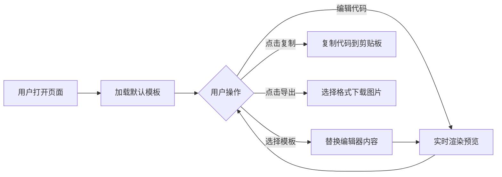

# 产品需求文档 (PRD)：Mermaid 实时编辑器

## 1. 产品概述

**Mermaid Live Editor** 是一款基于 Web 的实时 Mermaid 图表编辑与预览工具。用户可以在左侧编辑器中编写 Mermaid 代码，右侧实时预览渲染结果，并支持一键复制代码和导出高清图片。

- **目标用户**：开发者、技术写作者、架构师、学生
- **核心价值**：提供类似官方 Mermaid Live Editor 的本地化、可定制的编辑体验

## 2. 核心功能

### 2.1 功能模块

1. **编辑器主页面**：代码编辑区 + 实时预览区 + 工具栏
2. **示例模板库**：内置常用 Mermaid 图表模板
3. **导出功能**：支持 PNG/SVG/PDF 多格式导出

### 2.2 页面详情

| 页面名称 | 模块名称 | 功能描述 |
|---------|---------|---------|
| 主页面 | 代码编辑器 | 支持 Mermaid 语法高亮、自动补全、行号显示 |
| 主页面 | 实时预览区 | 即时渲染 Mermaid 图表，错误提示 |
| 主页面 | 工具栏 | 复制代码、导出图片、切换主题、重置内容 |
| 主页面 | 模板面板 | 预置流程图/序列图/饼图等模板 |

## 3. 核心流程

## 4. 用户界面设计

### 4.1 设计风格

- **主色调**：深色编辑器背景 (#1e1e1e) + 浅色预览区 (#ffffff)
- **强调色**：科技蓝 (#007acc) 用于按钮和交互元素
- **字体**：JetBrains Mono (代码) + Inter (界面)
- **布局风格**：左右分栏式布局，可拖拽调整比例
- **视觉风格**：现代 IDE 风格，简洁专业

### 4.2 页面设计概述

| 区域 | UI 元素 | 说明 |
|------|--------|------|
| 顶部工具栏 | Logo、标题、操作按钮组 | 复制、导出(PNG/SVG)、主题切换、模板 |
| 左侧编辑区 | 行号、语法高亮、自动缩进 | 支持 Tab 缩进、括号匹配 |
| 右侧预览区 | 图表渲染容器、错误提示 | 自动适应内容尺寸 |
| 底部状态栏 | 字符统计、渲染状态、快捷键提示 | 实时更新 |

### 4.3 响应式设计

- **桌面端优先**：左右分栏布局
- **平板适配**：上下堆叠模式
- **移动端优化**：单列视图，可切换编辑/预览

### 4.4 交互动效

- 工具栏按钮 hover 状态变化
- 复制成功时的反馈动画
- 导出时的加载指示器
- 模板选择的过渡动画
