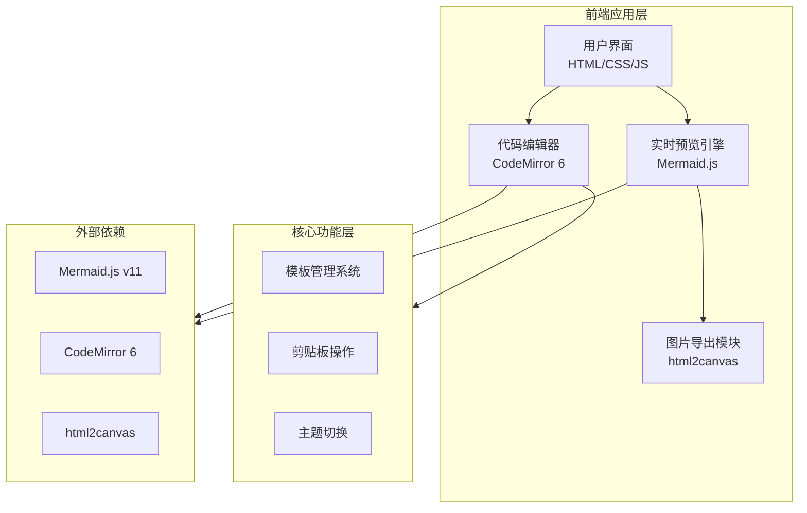

# 技术架构文档：Mermaid 实时编辑器

## 1. 架构设计



## 2. 技术选型

| 技术 | 版本 | 用途 |
|------|------|------|
| **HTML5** | - | 页面结构 |
| **CSS3** | - | 样式与动画 (Grid + Flexbox) |
| **JavaScript ES6+** | - | 核心逻辑 |
| **Mermaid.js** | v11.x | 图表渲染引擎 |
| **CodeMirror 6** | 最新版 | 代码编辑器组件 |
| **html2canvas** | latest | DOM 转图片 |

## 3. 文件结构

```
mermaid-editor/
├── index.html          # 主页面
├── css/
│   └── style.css       # 样式文件
├── js/
│   ├── app.js          # 主应用逻辑
│   ├── editor.js       # 编辑器配置
│   ├── preview.js      # 预览渲染逻辑
│   ├── export.js       # 导出功能
│   └── templates.js    # 模板数据
└── assets/
    └── icons/          # 图标资源
```

## 4. 功能模块说明

### 4.1 代码编辑器 (editor.js)
- 集成 CodeMirror 6，支持 Mermaid 语法高亮
- 配置：行号、自动缩进、括号匹配、Tab 大小
- 事件监听：input 事件触发实时预览

### 4.2 实时预览 (preview.js)
- 使用 Mermaid.js initialize() 初始化
- 监听编辑器内容变化，防抖处理后重新渲染
- 错误捕获与友好提示

### 4.3 导出功能 (export.js)
- **PNG 导出**：使用 html2canvas 截图预览区域
- **SVG 导出**：提取 Mermaid 生成的 SVG 元素
- **复制代码**：使用 Clipboard API

### 4.4 模板系统 (templates.js)
- 内置常用图表模板（流程图、序列图、饼图、甘特图等）
- 支持自定义模板扩展
