文章名称：YOLO11-VL — 一种视觉检测与多模态分析协同的建筑外墙裂缝智能诊断方法
1、技术路线图

```mermaid
flowchart LR
    subgraph INPUT["多源影像输入"]
        direction TB
        I1["无人机航拍影像<br/>建筑立面网格化采集"]
        I2["地面移动端影像<br/>裂缝近景特写拍摄"]
        I3["视频流影像<br/>巡检录像连续抽帧"]
    end

    subgraph YOLO["YOLO11 视觉检测分支<br/><i>（定量检测引擎）</i>"]
        direction TB
        Y1["CSPNet 骨干网络<br/>多层级裂缝特征提取"]
        Y2["PAN-FPN 特征金字塔<br/>多尺度裂缝特征融合"]
        Y3["解耦检测头"]
        Y4["分类头<br/>裂缝类型判别"]
        Y5["回归头<br/>边界框精确定位"]
        Y6["输出：检测框坐标 + 裂缝类别 + 置信度"]
    end

    subgraph VL["QwenVL 多模态分析分支<br/><i>（定性分析引擎）</i>"]
        direction TB
        V1["多模态输入构建<br/>原图 ⊗ 检测框叠加"]
        V2["视觉-语言跨模态对齐<br/>裂缝形态 ↔ 语义描述"]
        V3["专业分析推理"]
        V4["严重程度评估<br/>轻微 / 中等 / 严重"]
        V5["成因机制分析<br/>结构 / 温度 / 沉降"]
        V6["扩展趋势预判<br/>稳定 / 需关注 / 紧急"]
        V7["输出：分析文本 + 修复建议"]
    end

    subgraph FUSION["双模型协同融合"]
        direction TB
        F1["特征级协同<br/>YOLO 视觉特征 辅助 VL 注意力定位"]
        F2["决策级协同<br/>检测置信度 加权 VL 分析可信度"]
        F3["输出级协同<br/>定量数据 + 定性文本 → 完整诊断"]
    end

    subgraph OUTPUT["智能诊断输出"]
        direction TB
        O1["结构化审核报告"]
        O2["裂缝分布可视化"]
        O3["风险等级评定"]
        O4["修复方案建议书"]
    end

    INPUT --> Y1
    Y1 --> Y2 --> Y3
    Y3 --> Y4 --> Y6
    Y3 --> Y5 --> Y6
    Y6 --> V1
    Y6 --> F1
    V1 --> V2 --> V3
    V3 --> V4 --> V7
    V3 --> V5 --> V7
    V3 --> V6 --> V7
    V7 --> F2
    V7 --> F3
    F1 --> F3
    F2 --> F3
    F3 --> O1
    F3 --> O2
    F3 --> O3
    F3 --> O4

    Y6 -.->|"检测结果驱动<br/>VL 分析区域聚焦"| V1
    V7 -.->|"语义反馈增强<br/>降低检测误报"| Y6

    style INPUT fill:#f5f5f5,stroke:#616161,stroke-width:2px
    style YOLO fill:#e3f2fd,stroke:#1565c0,stroke-width:2px
    style VL fill:#fce4ec,stroke:#c62828,stroke-width:2px
    style FUSION fill:#ede7f6,stroke:#4527a0,stroke-width:2px
    style OUTPUT fill:#e8f5e9,stroke:#2e7d32,stroke-width:2px
```

> **路线图说明**：本路线以 YOLO11 视觉检测与 QwenVL 多模态分析的**双向协同**为设计核心。YOLO11 提供精确的裂缝空间定位与分类数据，驱动 VL 分析的区域聚焦；
QwenVL 则通过语义理解反馈降低检测误报。两分支在特征级、决策级、输出级三个层面实现深度融合，最终将**定量检测数据**与**定性分析文本**整合为结构化智能诊断报告。

2、结合本项目，总结本项目的内容、特点
3、引用本项目训练参数数据和截图
4、引用lw文件内文章
5、文章具有专业学术前沿
6、重复率要低

1、摘要和研究背景与工程需求添加城市体检和城市更新，
2在对应位置加入1w文件夹内的png图片
3用tra524dab54文件英内woights文件内的数据更新表5代表行训练实验结果对比内524dab54的数据，把文件夹内的参数的png图片添加到对应的位置
4、增加表6模型评估实验结果内524dab54的模型评估结果
