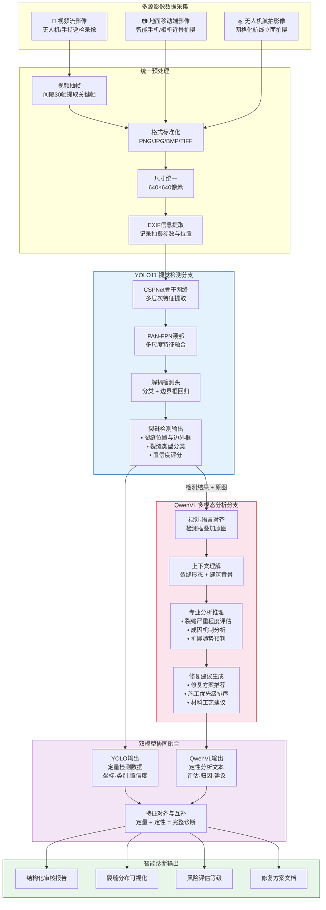

# 技术路线图：YOLO11-VL — 一种视觉检测与多模态分析协同的建筑外墙裂缝智能诊断方法

> **路线图说明**：本技术路线以 **YOLO11 视觉检测**与 **QwenVL 多模态分析**的协同为核心，体现"定量检测 + 定性分析 → 完整诊断"的创新范式。两条分支既独立运行又互相增强——YOLO11 提供精确的裂缝定位与分类数据，QwenVL 在此基础上进行专业级语义理解与推理，最终融合生成结构化诊断报告。
