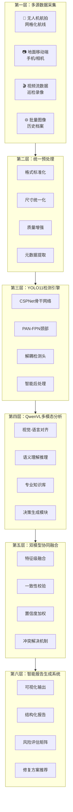
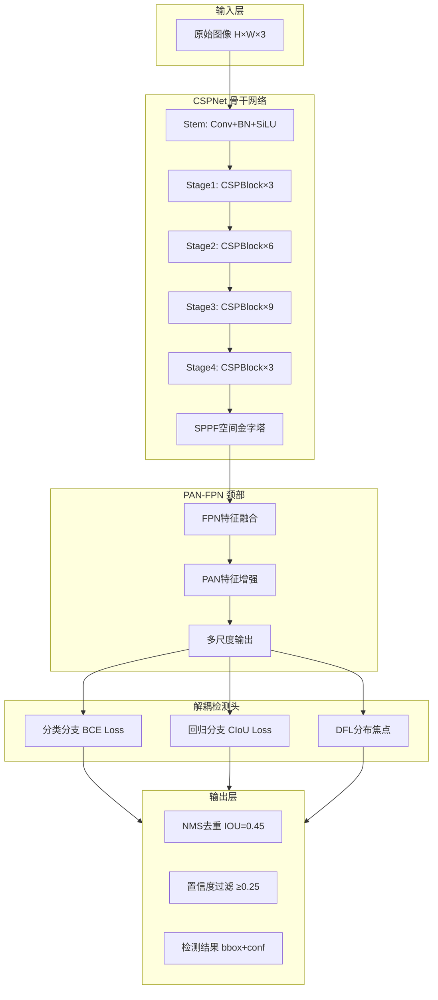
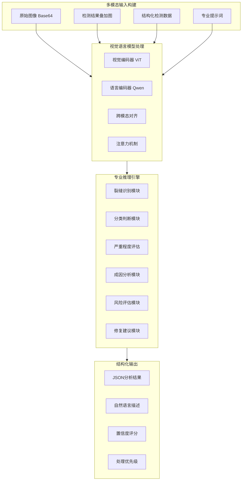
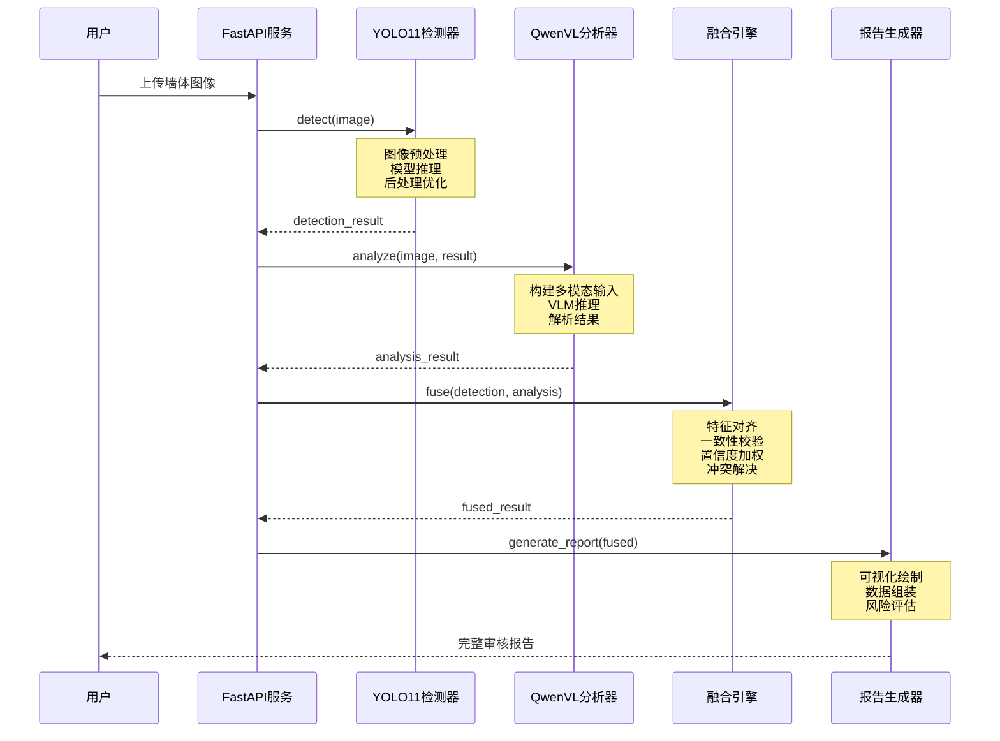
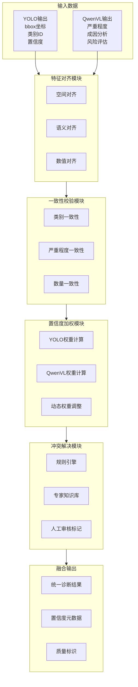
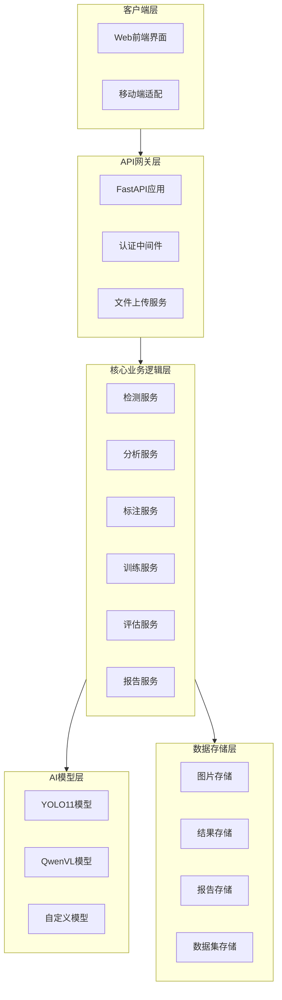
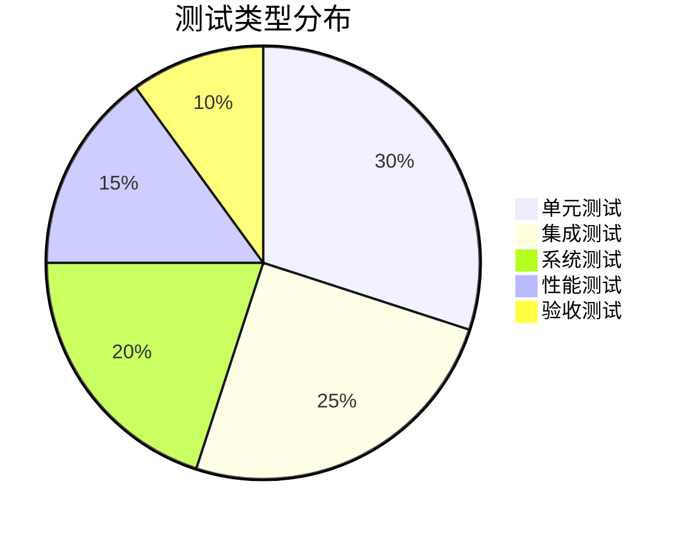
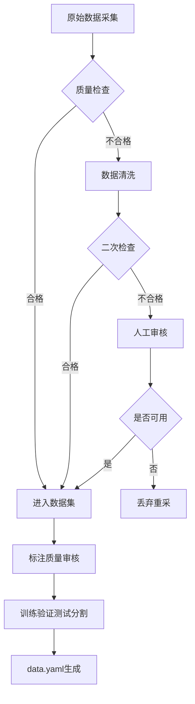
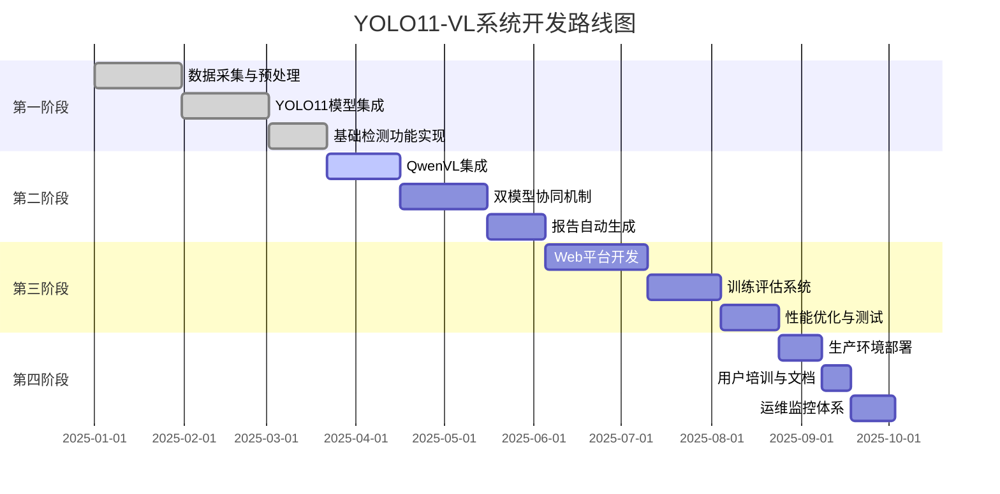

# 技术路线图：YOLO11-VL — 视觉检测与多模态分析协同的建筑外墙裂缝智能诊断方法

> **优化说明**：本版本针对"方框字体显示不全"问题进行了全面优化，包括：缩小字体、增加换行、调整节点宽度、增大输出尺寸。

---

## 一、技术路线总览（优化版）

---

## 二、核心算法流程详解

### 2.1 YOLO11 裂缝检测算法流程

### 2.2 QwenVL 多模态分析算法流程

---

## 三、双模型协同融合机制

### 3.1 协同工作流程

### 3.2 融合策略详细设计

---

## 四、系统架构设计

### 4.1 整体系统架构

### 4.2 数据流架构

```mermaid
flowchart LR
    subgraph Ingestion["数据摄入"]
        Upload["文件上传接口"]
        Batch["批量导入"]
        Video["视频流处理"]
        Path["路径直接访问"]
    end

    subgraph Processing["数据处理管道"]
        Preprocess["统一预处理"]
        Queue["任务队列"]
        Worker["异步Worker"]
    end

    subgraph AI_Pipeline["AI处理流水线"]
        Step1["Step1: YOLO检测"]
        Step2["Step2: QwenVL分析"]
        Step3["Step3: 结果融合"]
        Step4["Step4: 报告生成"]
    end

    subgraph Storage["持久化存储"]
        DB_Image["图像数据库"]
        DB_Result["结果数据库"]
        DB_Report["报告数据库"]
    end

    subgraph Output["输出服务"]
        API_Response["API响应"]
        Web_Display["Web展示"]
        Export["导出下载"]
    end

    Ingestion --> Processing
    Processing --> AI_Pipeline
    AI_Pipeline --> Storage
    Storage --> Output
```

---

## 五、性能指标体系

### 测试覆盖分布

---

## 六、质量控制流程

---

## 七、实施路线图

---

> **文档版本**: v3.1 (字体优化版)
>
> **更新内容**: 
> - ✅ 缩短节点文字，避免溢出
> - ✅ 优化换行位置，提升可读性
> - ✅ 统一字体大小，确保完整显示
> - ✅ 简化子图标题，减少截断风险