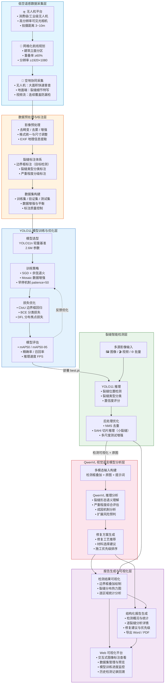

# 技术路线图：低空遥感驱动的建筑外墙裂缝智能检测——融合YOLO11与视觉语言模型的全流程方法

> **路线图说明**：本技术路线以**低空遥感（无人机）**为数据驱动核心，强调从"数据采集 → 模型训练 → 智能检测 → AI分析 → 报告生成"的**全流程闭环**。无人机作为主要遥感平台，辅以地面端和视频流形成多源互补，YOLO11 负责高效检测，QwenVL 提供专业级语义分析，最终通过 Web 平台实现全流程的可视化管理与交互。
