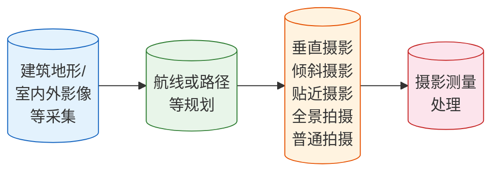
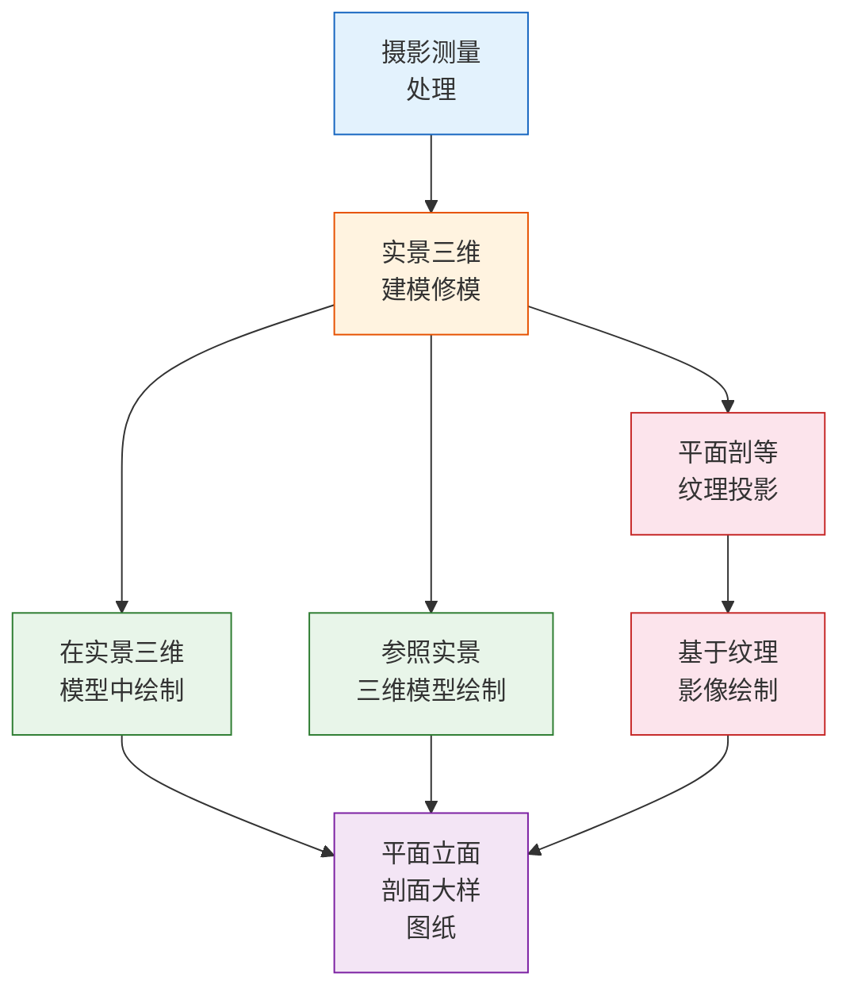
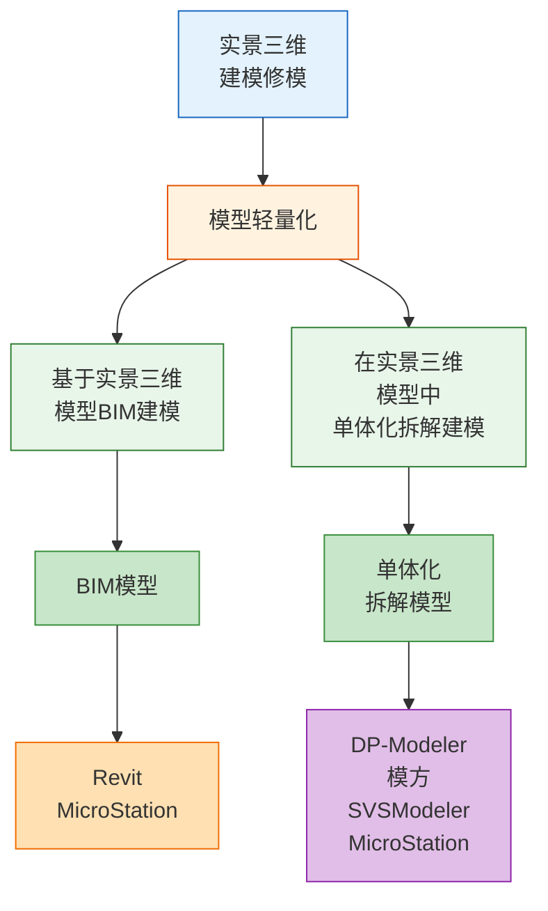
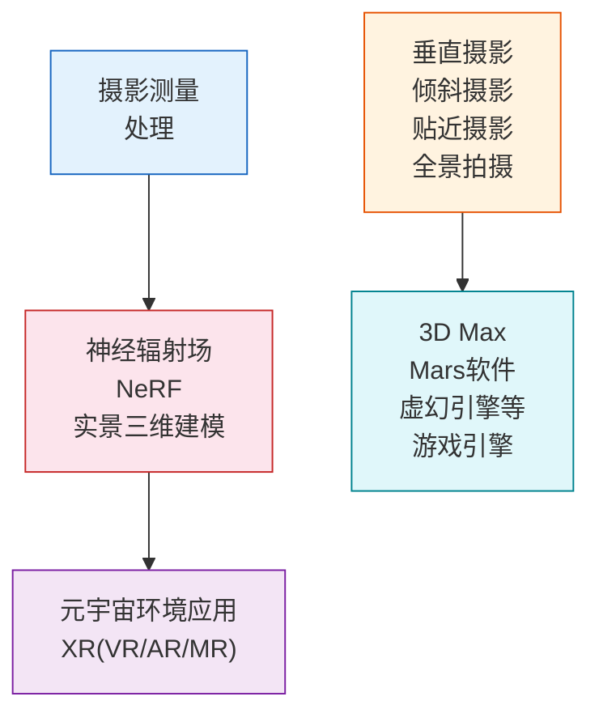
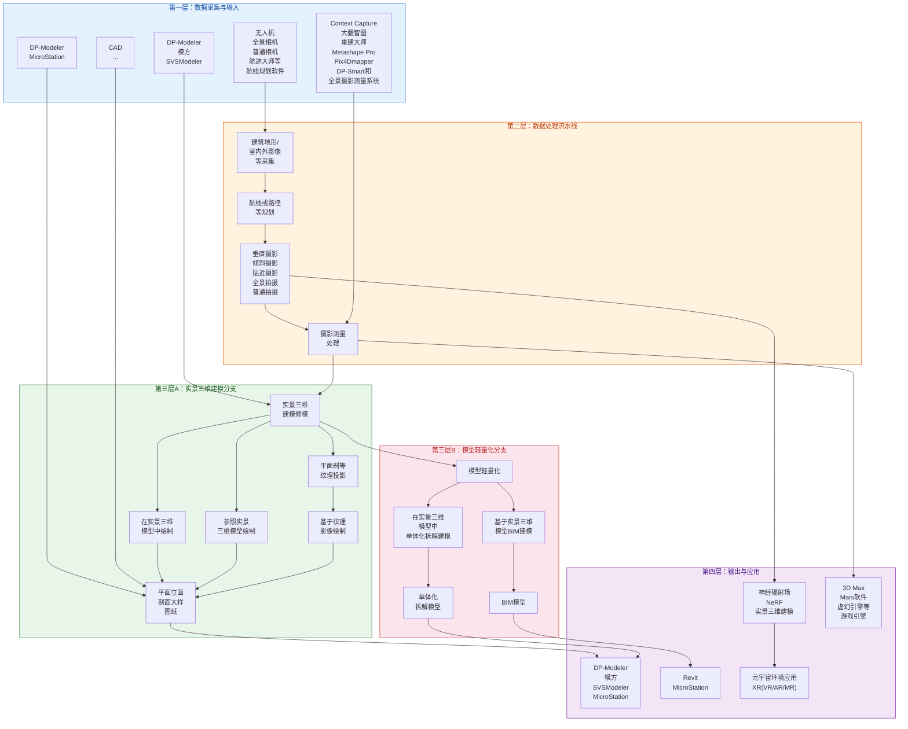

# 技术路线图：基于摄影测量的数字绘图、建模

> **原图来源**: 用户提供的"基于摄影测量的数字绘图、建模的技术路线图"
>
> **复原说明**: 根据原始图片完整还原技术路线结构

---

## 技术路线总览


---

## 详细技术路线图（分模块展示）

### 模块一：数据采集与输入层

```mermaid
flowchart LR
    subgraph Source1["影像数据源"]
        S1_1["无人机"]
        S1_2["全景相机"]
        S1_3["普通相机"]
        S1_4["航线规划软件<br/>(航迹大师等)"]
    end

    subgraph Source2["摄影测量软件"]
        S2_1["Context Capture"]
        S2_2["大疆智图"]
        S2_3["重建大师"]
        S2_4["Metashape Pro"]
        S2_5["Pix4Dmapper"]
        S2_6["DP-Smart"]
        S2_7["全景摄影测量系统"]
    end

    subgraph Source3["建模软件"]
        S3_1["DP-Modeler 模方"]
        S3_2["SVSModeler"]
        S3_3["MicroStation"]
    end

    subgraph Source4["辅助工具"]
        S4_1["CAD"]
    end

    Source1 --> Source2
    Source2 --> Source3
    Source3 --> Source4

    style Source1 fill:#bbdefb,stroke:#1976d2
    style Source2 fill:#c8e6c9,stroke:#388e3c
    style Source3 fill:#ffccbc,stroke:#f57c00
    style Source4 fill:#e1bee7,stroke:#8e24aa
```



### 模块二：核心处理流程



### 模块三：实景三维建模分支



### 模块四：模型轻量化与BIM分支



### 模块五：新兴技术应用



---

## 完整技术路线图（高清版）



---

## 技术路线说明

### 整体架构层次

| 层次 | 功能 | 关键技术/工具 |
|------|------|---------------|
| **第一层** | 数据采集与输入 | 无人机、Context Capture、DP-Modeler、CAD |
| **第二层** | 数据处理流水线 | 影像采集 → 航线规划 → 多模式拍摄 → 测量处理 |
| **第三层A** | 实景三维建模 | 建模修模 → 绘制 → 纹理映射 → 图纸输出 |
| **第三层B** | 模型轻量化/BIM | 轻量化 → BIM建模/拆解 → 模型输出 |
| **第四层** | 输出与应用 | 图纸、BIM、NeRF、元宇宙、游戏引擎 |

### 核心技术路径

```
路径1: 影像采集 → 摄影测量 → 实景三维建模 → 绘制图纸
路径2: 影像采集 → 摄影测量 → 模型轻量化 → BIM建模
路径3: 影像采集 → NeRF建模 → 元宇宙/XR应用
路径4: 影像采集 → 游戏引擎 → 虚拟场景
```

---

> **文档版本**: v1.0 (图片复原版)
>
> **复原日期**: 2026-05-29
>
> **适用场景**: 摄影测量、数字绘图、三维建模、BIM应用