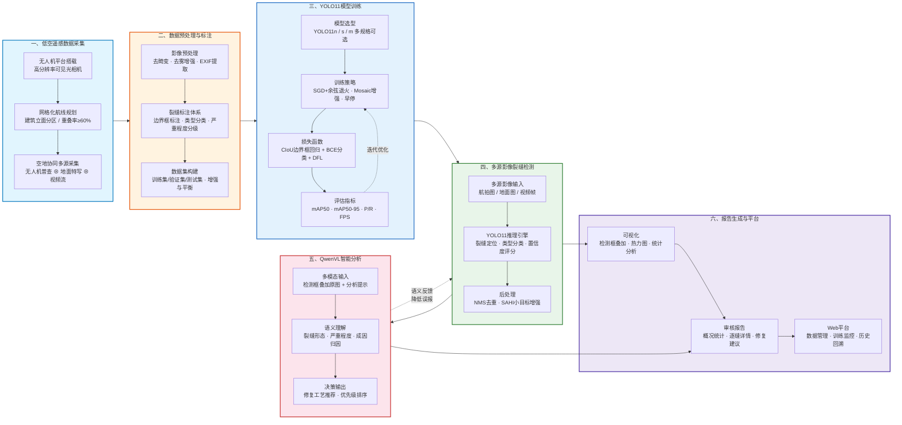

# 技术路线图：低空遥感驱动的建筑外墙裂缝智能检测——融合YOLO11与视觉语言模型的全流程方法

> **路线图说明**：以**低空遥感（无人机）**为数据驱动起点，构建"采集→标注→训练→检测→分析→报告"六阶段全流程闭环。无人机作为核心遥感平台完成大面积快速普查，地面端与视频流提供细节补充，YOLO11承担高效视觉检测，QwenVL完成专业语义分析，最终通过Web平台实现从原始影像到结构化诊断报告的全链路自动化。
