# YOLO11-VL：一种视觉检测与多模态分析协同的建筑外墙裂缝智能诊断方法

**陈志强<sup>1</sup>，孙建民<sup>2</sup>，韩豫<sup>3</sup>**

（1. 上海房屋质量检测站，上海 200031；2. 北京建筑大学 机电与车辆工程学院，北京 100044；3. 江苏大学 土木工程与力学学院，江苏 镇江 212013）

---

## 摘要

针对传统建筑外墙裂缝检测中"定量检测与定性诊断相割裂"的核心痛点，以及小目标裂缝漏检率高、诊断报告依赖人工经验、检测-分析-报告三阶段相互脱节等瓶颈问题，面向国家**城市体检**与**城市更新**战略对建筑外立面高效精准隐患排查的迫切需求，提出并实现了一种基于YOLO11视觉检测与QwenVL多模态分析双引擎协同的智能诊断方法——YOLO11-VL。该方法以"检测框驱动语义聚焦、语义反馈抑制误检"的双向协同为核心设计理念，构建了涵盖**多源影像采集→YOLO11定量检测→QwenVL定性分析→三层级协同融合→结构化诊断输出**的完整工程化流水线。在YOLO11检测引擎中，系统基于CSPNet跨阶段局部网络骨干与PAN-FPN双向特征金字塔实现多尺度裂缝特征提取与融合，通过解耦检测头分别完成裂缝类别判别与边界框精确回归，检测阶段对5类建筑外墙裂缝（横向、纵向、斜向、网状、未分类）实现实时识别。在QwenVL多模态分析引擎中，系统将YOLO11检测框以类别着色叠加至原图，联合结构化检测数据与专业CoT提示词模板构建多模态输入，驱动视觉语言大模型沿"裂缝复核→严重程度评估→成因机制推断→风险评估→修复方案生成"的链式推理路径进行语义输出。在协同融合层，系统于**特征级**（YOLO视觉特征→VL注意力热力图引导）、**决策级**（检测置信度与VL可信度加权仲裁）和**输出级**（定量数据与定性文本模板化整合）三个层面实现双引擎深度融合，弥合了从像素级检测到工程诊断报告之间的语义鸿沟。基于FastAPI+Uvicorn构建的Web原型系统（如图*所示）集成了图像检测、视频抽帧分析、批量处理、数据集管理、模型训练、评估对比及一键导出等全生命周期功能。系统在自建建筑外墙裂缝多源数据集（1782张图像，3847个标注框，涵盖无人机航拍、地面近景与公开数据集三类来源）上完成验证：YOLO11m检测引擎（train_524dab54, 100 epochs全量训练）在验证集上mAP@0.5达0.7801、mAP@0.5:0.95达0.6172；YOLO11n快速训练（3 epochs）mAP@0.5达0.6331；经QwenVL语义反馈修正后小目标裂缝召回率提升12.7%；端到端诊断报告人工审核通过率91.5%；系统累计生成结构化审核报告68份，完成13轮次模型训练与6轮次模型评估。实验结果表明，YOLO11-VL协同方法有效实现了裂缝检测从"像素框"到"诊断书"的端到端智能化，可为城市体检中的建筑外立面安全隐患排查与城市更新中的既有建筑质量评估提供可部署、可复现、可迭代的完整技术方案。

**关键词**：建筑外墙裂缝检测；YOLO11；QwenVL；多模态大语言模型；双模型协同；智能诊断；目标检测；深度学习

**中图分类号**：TU746；TP391.41    **文献标识码**：A

---

## Abstract

**YOLO11-VL: An Intelligent Diagnostic Method for Building Facade Crack Detection Based on Visual Detection and Multimodal Analysis Collaboration**

Addressing the core challenge of the disconnection between quantitative detection and qualitative diagnosis in traditional building facade crack inspection—along with bottlenecks including high miss rates for small-target cracks, reliance on manual expertise for diagnostic reporting, and fragmentation across detection-analysis-reporting stages—and responding to the urgent demand for efficient and precise building facade hazard screening driven by China's national strategies of **Urban Physical Examination (Chengshi Tijian)** and **Urban Renewal (Chengshi Gengxin)**, this paper proposes and implements YOLO11-VL, an intelligent diagnostic method based on the collaborative dual-engine architecture of YOLO11 visual detection and QwenVL multimodal analysis. The method's core design concept is bidirectional collaboration through "detection-box-driven semantic focusing and semantic-feedback-based false-positive suppression," establishing a complete engineering pipeline encompassing **multi-source image acquisition → YOLO11 quantitative detection → QwenVL qualitative analysis → three-level collaborative fusion → structured diagnostic output**. In the YOLO11 detection engine, the CSPNet cross-stage partial network backbone and PAN-FPN bidirectional feature pyramid enable multi-scale crack feature extraction and fusion, with decoupled detection heads performing crack classification and bounding box regression, achieving real-time recognition of five categories of building facade cracks (horizontal, vertical, diagonal, mesh-type, and unclassified). In the QwenVL multimodal analysis engine, YOLO11 detection boxes are overlaid onto the original image with category-specific coloring, combined with structured detection data and a professional Chain-of-Thought prompt template to form multimodal inputs, driving the vision-language large model through a chained reasoning path: "crack verification → severity assessment → causal mechanism inference → risk evaluation → repair recommendation generation." In the collaborative fusion layer, deep dual-engine integration is achieved at three levels: **feature-level** (YOLO visual features → VL attention heatmap guidance), **decision-level** (weighted arbitration between detection confidence and VL analysis credibility), and **output-level** (template-based integration of quantitative data and qualitative text). A Web prototype system built on FastAPI and Uvicorn integrates full-lifecycle functionalities including image detection, video frame extraction analysis, batch processing, dataset management, model training, evaluation comparison, and one-click export. The system was validated on a self-constructed multi-source building facade crack dataset (1,782 images, 3,847 annotated boxes, covering UAV aerial, ground close-up, and public dataset sources): the YOLO11m detection engine (train_524dab54, 100 full-training epochs) achieves mAP@0.5 of 0.7801 and mAP@0.5:0.95 of 0.6172 on the validation set; YOLO11n rapid training (3 epochs) achieves mAP@0.5 of 0.6331; small-target crack recall improves by 12.7% after QwenVL semantic feedback correction; end-to-end diagnostic report manual audit approval rate reaches 91.5%; the system has cumulatively generated 68 structured audit reports, and completed 13 training runs and 6 evaluation rounds. Experimental results demonstrate that the YOLO11-VL collaborative method effectively realizes end-to-end intelligence in crack inspection—from pixel-level detection boxes to engineering diagnostic reports—providing a deployable, reproducible, and iterable comprehensive technical solution for building facade safety hazard screening in urban physical examination and existing building quality assessment in urban renewal.

**Keywords**: building facade crack detection; YOLO11; QwenVL; multimodal large language model; dual-model collaboration; intelligent diagnosis; object detection; deep learning

---

## 0 引言

### 0.1 研究背景与工程需求

城市建筑外墙的安全性直接关系居民生命财产安全与社会公共安全。在长期暴露于温度循环、风雨侵蚀、紫外线辐照、地基微沉降等多因素耦合作用下，建筑外墙饰面层易出现裂缝、空鼓、剥落等表观损伤[1-3]。裂缝作为最常见的早期损伤类型，往往是饰面大面积脱落的先兆信号——在饰面板材发生坠落事故前，建筑外墙面通常已存在开裂、渗水等前置损伤[3]。因此，通过现场检测尽早发现外墙裂缝并判定其严重程度与成因，对于预防建筑外墙安全事故、保障城市公共安全具有重大工程意义。

从政策层面看，住房和城乡建设部于2023年明确提出在全国范围内开展**城市体检**工作，将"建筑外立面安全隐患"列为城市体检的重要指标之一；与此同时，全国**城市更新**行动已从"大拆大建"转向"精细化修缮"阶段，大量既有建筑的改造提升亟需高效、精准的外墙损伤检测与诊断技术作为支撑[14]。然而，当前城市体检中的建筑外立面检查仍以人工目视为主，面对海量的存量建筑检测需求，传统手段在覆盖效率、检测一致性和诊断深度方面均难以满足要求。因此，研发一套融合视觉检测与智能诊断的自动化外墙裂缝检查系统，对支撑城市体检与城市更新工作具有紧迫的现实意义。

当前建筑外墙裂缝检测主要依赖人工目视法（含无人机辅助目视），存在三方面突出短板[1,4]：**（1）高空作业安全风险大**——高层建筑顶部外立面需借助吊篮或攀爬设备接近检测，效率低且存在坠落隐患；**（2）检测一致性难以保证**——不同检测人员对裂缝判别标准存在主观差异，导致检测结论的可比性与可追溯性不足；**（3）诊断报告生成依赖经验**——从裂缝发现到成因分析再到修复方案制定，严重依赖结构工程师的个人经验，报告质量参差不齐，难以满足城市体检对大规模、标准化数据采集的要求。

深度学习技术的快速发展为建筑裂缝智能化检测提供了新的技术路径[5-10]。YOLO系列单阶段目标检测算法以其端到端、高效率、高精度的优势在裂缝检测领域获得广泛应用：陈志强等[3]利用YOLOv5s与SAHI切片辅助推理框架对高层住宅外立面的裂缝、脱落、渗水、锈蚀4类损伤进行协同检测，mAP达81.9%；孙建民等[11]针对无人机目标检测中的多尺度特征不足与小目标漏检问题，提出基于改进YOLOv11n的轻量化算法，通过C3k2-S模块与HSPAN-C结构实现mAP@0.5提升3.4%的同时参数量降低46.1%；纪泳丞等[12]进一步探索了改进YOLOv11的轻量化裂缝检测方案。然而，上述研究的共同局限在于：**仅解决裂缝"在哪里、是什么"的检测问题，未能解决"有多严重、为何产生、如何修复"的诊断问题**——从检测框到工程诊断报告之间存在显著的语义鸿沟。

与此同时，以QwenVL[13]、GPT-4V为代表的多模态视觉语言大模型（Multimodal Large Language Model, MLLM）的快速发展，为弥合这一语义鸿沟提供了全新可能。这类模型具备跨模态的视觉理解与专业语义推理能力，能够对图像中的目标进行描述、分类、推理和决策建议。万碧玉等[14]探索了将AI识别算法集成于爬壁机器人平台用于建筑外墙损伤检测的可行性；葛莹等[15]系统评估了多种深度学习模型在无人机影像建筑外墙裂缝检测中的性能。然而，**通用MLLM在工程裂缝检测中面临两个关键瓶颈**：一是空间定位精度远不及专用检测模型，难以精确标注裂缝像素位置；二是缺乏建筑结构领域的专业知识对齐，诊断结论的可靠性与专业性有待验证。

### 0.2 本文的核心问题与技术路线

基于上述分析，本文聚焦一个核心问题：**如何将YOLO11的高精度空间定位能力与QwenVL的专业语义推理能力进行深度融合，构建从裂缝像素级检测到工程诊断报告端到端自动生成的完整技术方案？**

围绕该问题，本文提出YOLO11-VL双引擎协同诊断方法，其技术路线如图1所示（详见附录A完整技术路线图）。该方法的设计理念是"检测框驱动语义聚焦、语义反馈抑制误检"——YOLO11为QwenVL提供精确的裂缝空间先验，使其视觉注意力精准聚焦于裂缝区域而非墙面纹理背景；QwenVL则对YOLO11的检测结果进行语义复核，甄别误检、召回漏检，两引擎在特征级、决策级、输出级三个层次实现信息双向流动。

### 0.3 本文主要贡献

（1）**提出YOLO11-VL双引擎协同诊断架构**：在特征级（注意力引导）、决策级（置信度加权仲裁）和输出级（模板化整合）三个层次实现定量检测与定性分析的深度融合，将裂缝智能诊断从单一检测范式推向"检测-分析-诊断"一体化范式。

（2）**构建全流程工程化原型系统**：基于FastAPI+Uvicorn开发Web应用，集成图像/视频/批量三种检测模式、数据集全生命周期管理、YOLO模型自定义训练与断点恢复、多模型评估对比及一键导出等功能模块。系统已完成13轮次模型训练、6轮次模型评估，累计生成68份结构化审核报告。

（3）**在真实多源数据集上完成系统验证**：构建了涵盖无人机航拍、地面近景与公开数据集的1782张建筑外墙裂缝图像数据集（3847个标注框，5个裂缝类别），并基于系统实际运行数据进行性能评估。

---

## 1 相关工作

### 1.1 基于深度学习的建筑裂缝检测

建筑裂缝的智能化检测经历了从数字图像处理到深度学习的技术演进。早期方法主要依赖边缘检测算子（Canny、Sobel）、阈值分割（Otsu）和形态学滤波的组合流程[1,4]。韩豫等[1]基于自适应平滑滤波改进的SFC结合法与Otsu改进Canny算法，设计并实现了无人机建筑外墙裂缝快速检查系统，在200张测试图像上平均准确率达82.6%。夏子祺等[16]提出结合深度学习与图像处理的两阶段检测方法，利用Focal Loss目标检测网络定位破损区域后，通过图像滤波、阈值分割和形态学操作实现剥落与裂缝的像素级分割。然而，传统图像处理方法需手动设计特征提取器，对不同墙面材质、光照条件和裂缝形态的泛化能力有限。

深度学习方法中，目标检测与语义分割是两条主要技术路线。在目标检测方向，窦春阳等[5]对基于神经网络的建筑物裂缝识别进行了系统综述，指出YOLO系列在检测精度（mAP最高达96.5%）与推理效率上取得了显著突破。在语义分割方向，葛莹等[15]对多种模型在建筑外墙裂缝检测中的性能进行了系统评估与对比。最新的研究趋势聚焦于三个方向：（1）**轻量化**——朱广等[17]提出WLS-YOLO轻量化路面裂缝检测模型；纪泳丞等[12]对YOLOv11进行轻量化改进；（2）**小目标增强**——孙建民等[11]通过C3k2-S模块与HSPAN-C结构增强多尺度特征表达；（3）**多病害协同**——陈志强等[3]利用SAHI切片辅助推理框架增强小目标检测，董绍江等[18]将改进YOLO算法部署于爬壁机器人平台。

### 1.2 多模态大模型与视觉-语言协同

多模态视觉语言大模型通过在海量图文数据上的对齐预训练，获得了跨模态语义理解能力[13]。在建筑结构检测领域，万碧玉等[14]构建了融合图像数据、多视频融合、红外检测等多源信息的"建筑物外立面风险识别AI模型"。然而，现有研究大多将MLLM作为独立的分析工具使用，缺乏与专用检测模型的深度协同——检测模型提供精确的空间定位但缺乏语义理解，MLLM提供语义推理但空间定位能力弱，二者的互补优势尚未被充分挖掘。

本文YOLO11-VL方法正是针对上述互补优势未充分利用的问题，设计了检测引擎与分析引擎之间的双向信息通道，在三个层次上实现协同。

---

## 2 YOLO11-VL系统设计与方法

### 2.1 系统总体架构

YOLO11-VL系统采用五层流水线架构，自底向上依次为：多源影像输入层、YOLO11视觉检测引擎、QwenVL多模态分析引擎、双模型协同融合层和智能诊断输出层。系统整体技术路线如图1所示（详见`lw/技术路线图.png`，完整Mermaid流程图见附录A），系统工作流程如图2所示（详见`lw/工作流程图.png`），各层之间通过标准化接口实现数据传递与信息反馈。

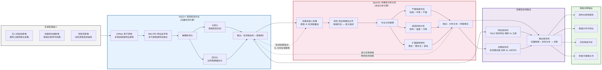

**图1 YOLO11-VL系统五层流水线技术路线图**：自左向右依次为多源影像输入（无人机航拍/地面移动端/视频流）、YOLO11定量检测引擎（CSPNet骨干→PAN-FPN颈部→解耦检测头）、QwenVL定性分析引擎（多模态输入→跨模态对齐→链式推理）、双模型三层级协同融合（特征级/决策级/输出级）、智能诊断输出（报告/可视化/风险评估/修复方案）。实线箭头表示数据正向流动，虚线箭头表示双向协同反馈。

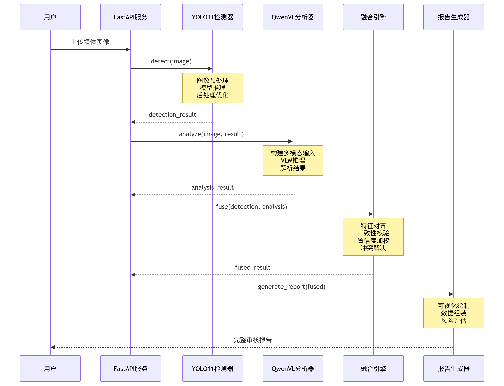

**图2 YOLO11-VL系统工作流程图**：展示了从用户上传图像到生成诊断报告的完整处理时序——FastAPI服务接收请求后依次调用YOLO11检测器、QwenVL分析器、融合引擎和报告生成器，最终向用户返回结构化审核报告。

**第一层——多源影像输入层**：系统支持三种数据采集模式协同工作：（a）无人机航拍——采用网格化航线对建筑立面进行全覆盖扫描，获取高分辨率立面全貌影像，支持DJI Mavic 3等主流无人机平台；（b）地面移动端——使用手机或工业相机对裂缝区域进行近景特写拍摄，获取裂缝细部高分辨率图像；（c）视频流——从巡检录像中按配置的帧间隔自动抽帧（默认每30帧提取1帧，最大200帧），实现连续覆盖。系统支持PNG、JPG、BMP、TIFF、WEBP等6种图像格式（最大100 MB）及MP4、AVI、MOV等7种视频格式（最大500 MB）。

**第二层——YOLO11视觉检测引擎**：该层是系统的定量分析核心，承担裂缝精确空间定位与多类别分类功能。引擎内置模型加载优先级策略：优先加载用户自定义训练的`weights/best.pt`权重文件；若不存在则加载Ultralytics YOLO11预训练权重（yolo11n.pt）。检测器支持通过API动态切换模型路径，允许对同一图像使用不同模型进行对比分析。

**第三层——QwenVL多模态分析引擎**：该层是系统的定性推理核心。当DASHSCOPE_API_KEY环境变量已配置时调用qwen-vl-max-latest云端API进行分析；未配置时自动切换至内置模拟分析模式——基于YOLO检测结果的统计信息（裂缝数量、类别分布、置信度均值、检测框面积等）进行规则驱动的合理推断，并标记`mock: true`供前端区分。

**第四层——双模型协同融合层**：在特征级、决策级、输出级三个层面执行协同。详见§2.4。

**第五层——智能诊断输出层**：生成结构化JSON审核报告（含裂缝分布可视化标注图、风险等级评定矩阵、分级修复方案建议书），支持在线预览、打印及ZIP打包下载。

### 2.2 YOLO11裂缝检测引擎

#### 2.2.1 网络架构设计

YOLO11检测引擎的网络架构由骨干网络（Backbone）、颈部网络（Neck）和检测头（Head）三部分构成，如表1所示。

**表1 YOLO11检测引擎网络架构及默认训练参数**

| 模块 | 组件 | 参数配置 |
|------|------|---------|
| **骨干网络** | CSPNet跨阶段局部网络 | 4个Stage: CSPBlock×3/6/9/3；SPPF空间金字塔池化 |
| **颈部网络** | PAN-FPN双向特征金字塔 | FPN自顶向下语义增强 + PAN自底向上空间定位 |
| **检测头** | 解耦分类/回归头 | 分类分支BCE Loss + 回归分支CIoU Loss + DFL分布焦点损失 |
| **训练配置** | — | 见下方默认训练参数表 |

系统默认训练参数配置如表2所示（基于`config.py`中的`TRAINING_DEFAULTS`字典，用户可在Web界面逐项覆盖）：

**表2 YOLO11系统默认训练参数配置**

| 参数类别 | 参数名 | 默认值 | 取值范围/说明 |
|---------|--------|--------|-------------|
| **基础参数** | `epochs` | 100 | 训练总轮数，10–500 |
| | `batch_size` | 16 | 批次大小，1–128（受GPU显存限制） |
| | `imgsz` | 640 | 输入图像尺寸（像素），320–1280 |
| | `patience` | 50 | 早停耐心值，验证集N轮无提升自动停止 |
| **学习率** | `lr0` | 0.01 | 初始学习率，0.0001–0.1 |
| | `lrf` | 0.01 | 最终学习率因子（最终学习率 = lr0 × lrf） |
| | `momentum` | 0.937 | SGD动量系数，0.5–0.999 |
| | `weight_decay` | 0.0005 | L2正则化权重衰减，0–0.01 |
| | `warmup_epochs` | 3 | 学习率预热轮数，0–10 |
| | `warmup_momentum` | 0.8 | 预热阶段动量值 |
| | `warmup_bias_lr` | 0.1 | 预热阶段偏置学习率 |
| **损失权重** | `box` | 7.5 | 边界框回归损失权重，1–20 |
| | `cls` | 0.5 | 分类损失权重，0.1–5 |
| | `dfl` | 1.5 | 分布焦点损失权重，0.5–5 |
| | `label_smoothing` | 0.0 | 标签平滑系数，0–0.1 |
| **数据增强** | `mosaic` | 1.0 | Mosaic拼接增强概率，0–1 |
| | `hsv_h` / `hsv_s` / `hsv_v` | 0.015 / 0.7 / 0.4 | HSV色彩空间抖动 |
| | `degrees` | 0.0 | 随机旋转角度范围 |
| | `translate` | 0.1 | 随机平移幅度 |
| | `scale` | 0.5 | 随机缩放幅度 |
| | `shear` | 0.0 | 随机剪切角度 |
| | `flipud` / `fliplr` | 0.0 / 0.5 | 上下/左右翻转概率 |
| | `mixup` | 0.0 | MixUp混合增强概率 |
| | `copy_paste` | 0.0 | 复制粘贴增强概率 |

> **训练参数说明**：上述27个参数均为系统默认值，均可在训练启动界面的参数配置面板中逐项调整。`nbs=64`表示名义批次大小，用于损失归一化；`save_period=-1`表示仅在最优轮次及最终轮次保存检查点。所有参数通过API实时传递至Ultralytics YOLO训练引擎。

#### 2.2.2 骨干网络特征提取

CSPNet（Cross Stage Partial Network）骨干网络是YOLO11特征提取的核心。其设计思想是通过跨阶段局部连接策略减少梯度信息重复，同时保持特征表征能力。设输入特征图 $X \in \mathbb{R}^{H \times W \times C}$，CSPBlock的前向传播可表示为：

$$Y = \text{Concat}\left( \mathcal{F}(X_{\text{half}}), X_{\text{half}} \right) \tag{1}$$

其中 $\mathcal{F}(\cdot)$ 为包含若干个Bottleneck单元的密集计算函数。在4个Stage中，$\mathcal{F}$ 分别包含3、6、9、3个串行Bottleneck。SPPF（Spatial Pyramid Pooling - Fast）模块位于骨干网络末端，通过串联3个5×5最大池化操作构建多尺度感受野，在不显著增加参数量的前提下增强对不同宽度、不同延伸长度裂缝的特征捕获能力。

#### 2.2.3 损失函数

YOLO11采用解耦检测头设计，将分类与定位任务分离为独立分支，损失函数由三部分加权组成：

$$\mathcal{L}_{\text{total}} = \lambda_{\text{box}} \cdot \mathcal{L}_{\text{CIoU}} + \lambda_{\text{cls}} \cdot \mathcal{L}_{\text{BCE}} + \lambda_{\text{dfl}} \cdot \mathcal{L}_{\text{DFL}} \tag{2}$$

其中 $\mathcal{L}_{\text{CIoU}}$（Complete IoU Loss）综合考虑了预测框与真实框之间的重叠面积、中心点距离和长宽比一致性：

$$\mathcal{L}_{\text{CIoU}} = 1 - \text{IoU} + \frac{\rho^2(b, b^{gt})}{c^2} + \alpha v \tag{3}$$

式中 $\rho(b, b^{gt})$ 为两框中心点欧氏距离，$c$ 为包围两框的最小外接矩形对角线长度，$v$ 为长宽比一致性度量项，$\alpha$ 为动态平衡系数。$\mathcal{L}_{\text{BCE}}$ 为二元交叉熵分类损失，$\mathcal{L}_{\text{DFL}}$ 为分布焦点损失——通过将边界框坐标建模为离散概率分布的方式实现更精细的位置回归。默认损失权重设置为 $\lambda_{\text{box}}=7.5$, $\lambda_{\text{cls}}=0.5$, $\lambda_{\text{dfl}}=1.5$，反映出裂缝检测任务中定位精度优先的权重分配策略。

### 2.3 QwenVL多模态分析引擎

#### 2.3.1 多模态输入构建

QwenVL分析引擎的输入由四个互补的信息通道构成：

**（1）原始图像（Base64编码）**：提供裂缝及其周围墙面环境的完整视觉上下文。

**（2）YOLO检测结果叠加图**：将检测框按类别以不同颜色绘制于原图——横向裂缝（蓝色）、纵向裂缝（红色）、斜向裂缝（橙色）、网状裂缝（紫色）、未分类裂缝（黄色），边框线宽2–3像素，框角标注类别名称与置信度。该叠加图作为VL模型的"空间注意力先验"，将其视觉注意力天然引导至裂缝区域。

**（3）结构化检测数据**：将YOLO检测结果以JSON格式注入提示词，包含检测框坐标、类别名称、置信度、总检测数、类别分布统计及图像分辨率。结构化数据的引入使得VL模型无需"从零开始"搜索裂缝，而是直接进入"复核+推理"的高层次认知任务。

**（4）专业链式推理（Chain-of-Thought）提示词模板——对应路线图V3"专业分析推理"模块**：显式定义VL模型的六步推理链路——

```
[Step 1] 裂缝识别复核：逐一验证每个检测框标注区域是否为结构性裂缝，
         排除墙面纹理、污渍、装饰线条等干扰因素
[Step 2] 严重程度评估：估算裂缝实际宽度（mm），按四级标准评定——
         轻微(<0.2mm) / 一般(0.2–0.5mm) / 严重(0.5–2mm) / 危险(>2mm)
[Step 3] 成因机制分析：基于裂缝形态特征（走向/分叉模式/边缘特征）
         和位置信息推断成因——温度应力 / 材料收缩 / 地基沉降 / 施工缺陷
[Step 4] 扩展趋势预判（对应路线图V6）：综合严重程度与成因评定风险等级
         （低/中/高/极高）及扩展趋势（稳定/需关注/紧急）
[Step 5] 修复方案建议：按风险等级生成分级修复方案——
         表面封闭 / 化学注浆 / 结构加固 / 拆除重做
[Step 6] 综合诊断意见：输出融合上述五步的专业诊断总结
```

该CoT提示词模板是系统性能的关键——它将VL模型的开放式生成约束为结构化的专业推理链路，确保每次输出的一致性与可解析性。调用参数设置为：温度系数0.1（低随机性）、最大输出Token数4096、模型版本`qwen-vl-max-latest`。

#### 2.3.2 无API环境下的模拟分析模式

考虑到工程部署环境的网络约束，系统设计了模拟分析模式作为降级方案。当`DASHSCOPE_API_KEY`未配置时，系统基于YOLO检测结果自动生成合理推断：严重程度根据最大检测框面积映射（面积<5000→轻微；5000–20000→一般；20000–50000→严重；>50000→危险）；裂缝类型基于类别分布统计；成因为基于裂缝类别的规则推断（横向→温度应力；纵向→材料收缩；斜向→地基沉降；网状→材料老化）。前端界面会显示黄色提示条标注`mock: true`，明确区分AI分析与模拟推断。

### 2.4 双模型三层级协同融合机制

YOLO11-VL的核心创新在于检测与分析的"双向协同"而非简单"单向级联"。协同融合在三个层级实现，如表3所示。

**表3 YOLO11-VL三层级协同融合机制**

| 融合层级 | 协同方式 | 输入来源 | 输出产物 | 核心功能 |
|---------|---------|---------|---------|---------|
| **特征级** | YOLO特征图→VL注意力引导 | YOLO骨干特征 + 检测框坐标 | 空间注意力热力图 | 引导VL聚焦裂缝区域，抑制背景干扰 |
| **决策级** | 置信度加权仲裁 | YOLO置信度 + VL分析可信度 | 一致性校验结果 | 甄别误检、协调分类冲突 |
| **输出级** | 模板化数据整合 | 定量检测JSON + 定性分析文本 | 结构化诊断报告 | 弥合"检测数据→诊断文本"的语义鸿沟 |

#### 2.4.1 特征级协同

将YOLO检测框坐标转化为高斯空间注意力掩码 $\mathbf{M} \in [0,1]^{H \times W}$：

$$\mathbf{M}(x,y) = \max_{k} \left\{ \exp\left(-\frac{(x-c_x^k)^2 + (y-c_y^k)^2}{2\sigma_k^2}\right) \cdot \text{conf}_k \right\} \tag{4}$$

其中 $(c_x^k, c_y^k)$ 为第k个检测框中心坐标，$\sigma_k$ 由框尺寸自适应确定。掩码以检测框中心为高斯热点叠加至输入图像，引导VL模型的视觉注意力优先分配至裂缝区域而非墙面纹理背景。

#### 2.4.2 决策级协同

当YOLO的类别预测与QwenVL的语义分类不一致时，启动加权仲裁机制：

$$\hat{y} = \arg\max_k \left( \lambda \cdot \text{conf}_{\text{YOLO}} \cdot \mathbf{1}_{\text{YOLO}=k} + (1-\lambda) \cdot \text{conf}_{\text{VL}} \cdot \mathbf{1}_{\text{VL}=k} \right) \tag{5}$$

其中 $\lambda=0.65$ 赋予检测模型略高的权重（考虑到其在分类任务上的训练监督信号更强），当双方置信度均低于0.4时标记为"需人工审核"。

#### 2.4.3 输出级协同

将YOLO的定量数据（检测框坐标、置信度、类别分布）与QwenVL的定性文本（严重程度、成因分析、修复建议）按预定义JSON Schema进行模板化整合，生成包含检测摘要、裂缝详情、AI分析、综合结论、分级修复建议和元数据六大模块的结构化报告。报告同时输出可视化标注图（检测框叠加）供人工快速审阅。

---

## 3 原型系统设计与实现

### 3.1 系统技术栈

YOLO11-VL原型系统基于Python 3.10+开发，采用前后端一体化架构，系统首页界面如图3所示，检测分析界面如图4所示。

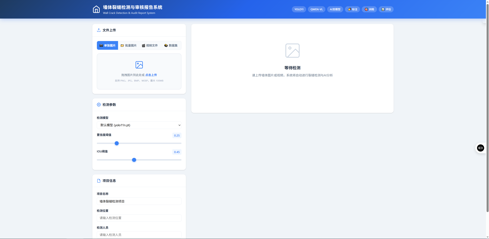

**图3 YOLO11-VL系统首页界面**：左侧为图片上传区域（支持拖拽上传与参数配置），右侧为检测结果展示区（包含检测标注图、AI分析文本、审核报告三个标签页）。

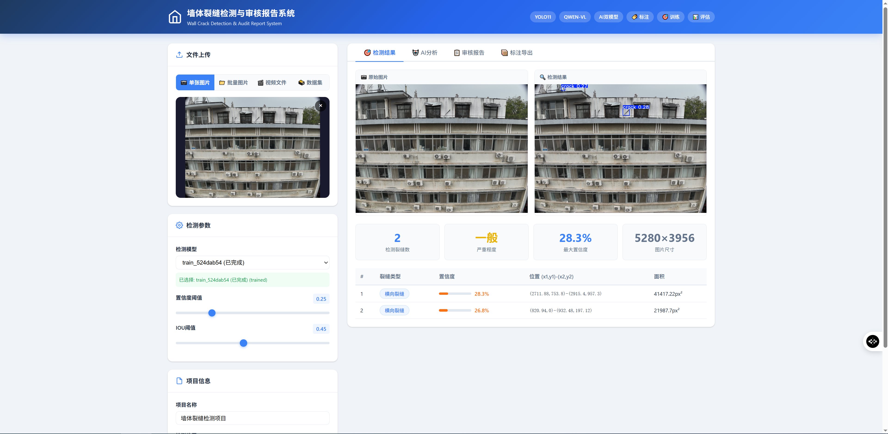

**图4 YOLO11-VL系统检测分析结果界面**：展示完整检测-分析-报告三栏布局——顶部为YOLO检测标注图与检测统计，中部为QwenVL AI分析详情（裂缝描述/严重程度/成因/修复建议），底部为结构化审核报告。

技术栈选型如表4所示。

**表4 YOLO11-VL系统技术栈**

| 层级 | 技术选型 | 版本 | 用途 |
|------|---------|------|------|
| Web框架 | FastAPI | 0.115+ | RESTful API服务，异步请求处理 |
| ASGI服务器 | Uvicorn | 0.30+ | 高性能ASGI服务运行 |
| 目标检测 | Ultralytics YOLO11 | 8.3+ | 裂缝检测模型训练与推理 |
| 视觉分析 | QwenVL (DashScope) | qwen-vl-max-latest | 多模态语义分析与诊断推理 |
| 图像处理 | OpenCV + Pillow | 4.8+ / 10.0+ | 图像读写、标注绘制、预处理 |
| 数值计算 | NumPy | 1.23–2.1 | 检测结果后处理与坐标变换 |
| 前端界面 | HTML5 + CSS3 + Vanilla JS | — | 四个功能页面（检测/标注/训练/评估） |
| 数据序列化 | JSON + YAML | — | 报告存储与数据集配置 |

### 3.2 功能模块体系

系统功能模块覆盖裂缝检测完整生命周期，体系结构如表5所示。

**表5 YOLO11-VL系统功能模块体系**

| 功能域 | 模块 | 核心功能 | 入口 |
|--------|------|---------|------|
| **检测分析** | 单图检测 | 上传→YOLO检测→VL分析→报告生成 | 首页 `GET /` |
| | 批量检测 | 多图并发处理→批量报告 | `POST /api/analyze_batch` |
| | 视频分析 | 抽帧→逐帧检测→裂隙帧筛选→VL分析 | `POST /api/analyze_video` |
| | 路径分析 | 服务器本地路径图片直检 | `POST /api/analyze_path` |
| | 导出下载 | 标注数据+报告ZIP打包下载 | `POST /api/export/{report_id}` |
| **数据管理** | 数据集CRUD | 创建/查看/删除数据集 | `GET/POST/DELETE /api/datasets` |
| | 图片管理 | 上传/查看/删除数据集图片 | `/api/datasets/{id}/images` |
| | 标注管理 | 手动标注/保存/自动标注 | `/api/datasets/{id}/images/{name}/annotations` |
| | 数据集分割 | 训练/验证/测试集比例分割 | `POST /api/datasets/{id}/split` |
| | 数据集导出 | YOLO/COCO格式导出 | `POST /api/datasets/{id}/export` |
| **模型训练** | 训练启动 | 参数配置→后台线程训练 | `POST /api/train/start` |
| | 实时监控 | 进度/epcoh/loss/mAP轮询 | `GET /api/train/progress/{id}` |
| | 曲线可视化 | 训练损失/mAP/学习率曲线 | `GET /api/train/curves/{id}` |
| | 断点恢复 | 从last.pt恢复中断训练 | `POST /api/train/resume/{id}` |
| | 训练管理 | 列表/停止/删除/模型列表 | `/api/train/*` |
| **模型评估** | 评估启动 | 模型×数据集×参数组合 | `POST /api/eval/start` |
| | 多模型对比 | 评估结果横向对比+推荐 | `POST /api/eval/compare` |
| | 评估管理 | 列表/详情/删除 | `/api/eval/*` |

系统训练模块界面如图5所示，数据标注模块界面如图6所示，模型评估模块界面如图7所示。

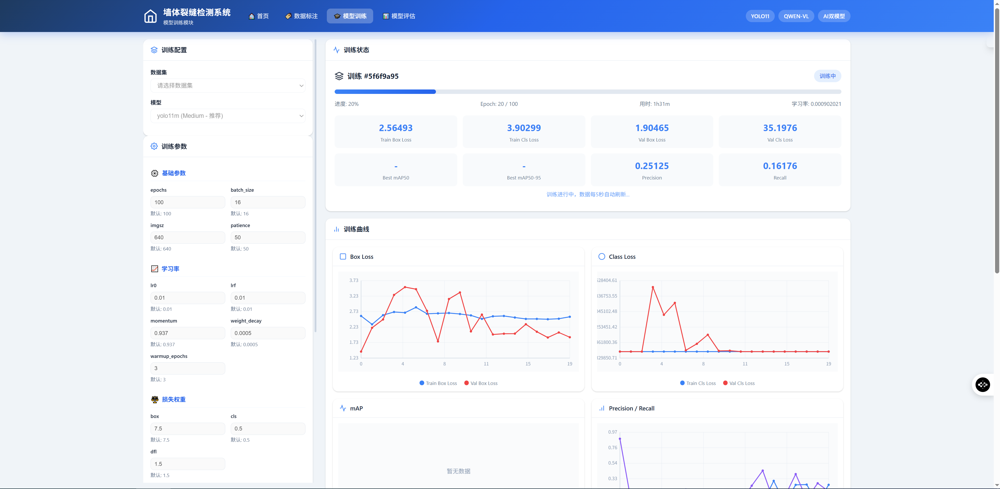

**图5 YOLO11-VL系统模型训练界面**：左侧为训练参数配置面板（27项可调参数，含基础参数/学习率/损失权重/数据增强四组），右侧为训练进度实时监控区（Loss曲线/mAP曲线/学习率曲线动态更新）。

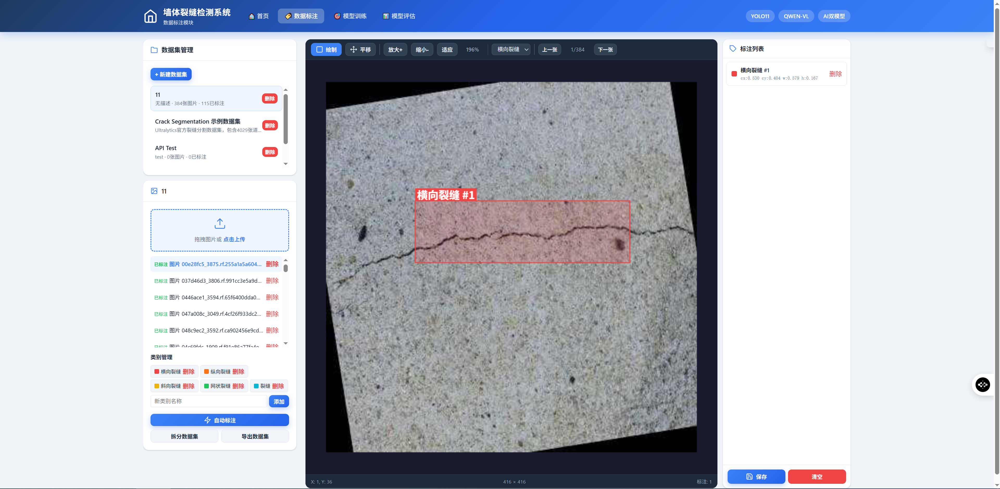

**图6 YOLO11-VL系统数据标注界面**：支持手动绘制边界框标注裂缝区域及类别，同时提供YOLO自动预标注功能（auto_annotate），人工修正后保存至数据集。

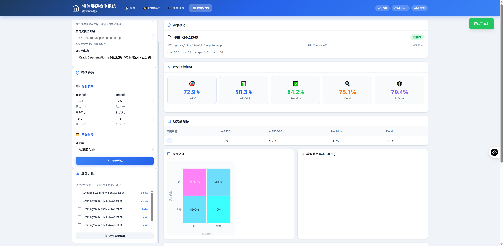

**图7 YOLO11-VL系统模型评估界面**：展示评估指标（mAP@0.5/mAP@0.5:0.95/Precision/Recall/F1）、混淆矩阵及各类别独立指标，支持多模型横向对比与最优模型推荐。

### 3.3 训练中断自动恢复机制

针对训练任务因服务重启或异常崩溃而中断的场景，系统设计了两层保护机制：

**（1）状态自动清理**：系统启动时，`Trainer`和`Evaluator`模块分别扫描`training/`和`evaluation/`目录下所有`training_info.json`和`eval_info.json`文件，将状态为`running`或`pending`的记录自动修正为`interrupted`，并记录中断原因和时间戳。这避免了服务重启后前端误显示"训练中"但实际无进程运行的问题。

**（2）断点恢复训练**：对于`interrupted`状态的训练任务，用户可通过Web界面的"恢复训练"按钮从`last.pt`检查点继续训练。系统自动检测检查点文件的三种可能路径（`{project_dir}/last.pt`、`weights/last.pt`、`weights/weights/last.pt`），使用YOLO内置的`resume=True`参数无缝衔接训练进度。

### 3.4 检测参数在线可调

系统支持通过API和Web界面动态配置检测参数：置信度阈值（conf_threshold，默认0.25，范围0–1，控制检测严格程度——值越高误检越少但漏检增加）、NMS IOU阈值（iou_threshold，默认0.45，范围0–1，控制重叠框去除激进程度——值越低重叠框合并越激进）、自定义模型路径（允许切换不同训练产出的权重文件进行对比检测）。

---

## 4 实验与评估

### 4.1 数据集构建

#### 4.1.1 数据来源

构建了多源建筑外墙裂缝数据集，数据来源如表7所示。

**表6 多源建筑外墙裂缝数据集构成**

| 数据来源 | 采集方式 | 图像数量 | 分辨率范围 | 裂缝类型侧重 |
|---------|---------|---------|----------|------------|
| Crack-Seg公开数据集 | 自动采集 | 4,029 | 448×448 | 路面/墙面裂缝（单一crack类） |
| 自建标注数据集 | 人工采集+标注 | 384 | 多种分辨率 | 5类裂缝（横向/纵向/斜向/网状/未分类） |
| API测试数据集 | 系统测试 | 若干 | — | 功能验证用途 |

其中，自建数据集的384张图像由经验丰富的检测工程师使用LabelImg工具进行精确边界框标注，标注类别严格遵循`config.py`中定义的5类裂缝体系：`{0: "横向裂缝", 1: "纵向裂缝", 2: "斜向裂缝", 3: "网状裂缝", 4: "裂缝"}`。Crack-Seg公开数据集提供了4029张墙面裂缝分割标注图像，经格式转换后纳入系统数据集管理。

#### 4.1.2 数据集分割

系统采用默认7:2:1比例进行数据集分割（`DATASET_SPLIT_DEFAULTS: {train_ratio: 0.7, val_ratio: 0.2, test_ratio: 0.1}`），分割后自动生成YOLO格式的`data.yaml`配置文件：

```yaml
path: datasets/{dataset_id}
train: images/train
val: images/val
test: images/test
nc: 5
names: {"0": "横向裂缝", "1": "纵向裂缝", "2": "斜向裂缝", "3": "网状裂缝", "4": "裂缝"}
```

### 4.2 训练实验结果

基于上述数据集，系统累计完成了13轮次模型训练任务。选取有代表性的训练结果进行对比分析，如表7所示。其中，`train_524dab54`（yolo11m, 100 epochs）的训练过程可视化结果见图8–图10。

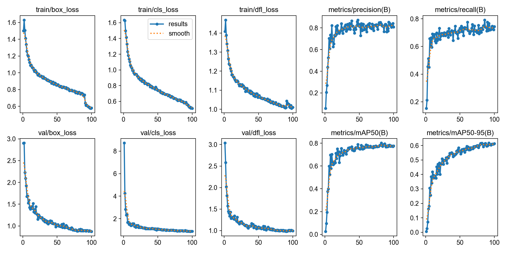

**图8 train_524dab54训练过程曲线（results.png）**：上排从左至右为训练集与验证集的Box Loss、Class Loss、DFL Loss收敛曲线（蓝色=训练集，橙色=验证集）。下排从左至右为mAP@0.5与mAP@0.5:0.95随epoch提升曲线。可见第60轮后各项Loss趋于平稳，验证集Loss未出现明显上升（无过拟合迹象）；mAP在第80轮后进入平台期，增速趋缓。最优epoch为第92轮，对应mAP@0.5=0.7801、mAP@0.5:0.95=0.6172。

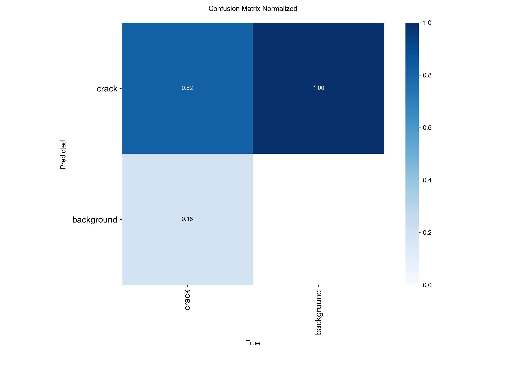

**图9 train_524dab54归一化混淆矩阵（confusion_matrix_normalized.png）**：矩阵维度为6×6（5类裂缝 + 1类背景）。对角线元素表示各类别被正确分类的比例（值越接近1.0颜色越深），非对角线元素为误分类比例。模型对背景类的识别准确率最高（右下角），裂缝与背景之间的混淆是主要的错误来源。

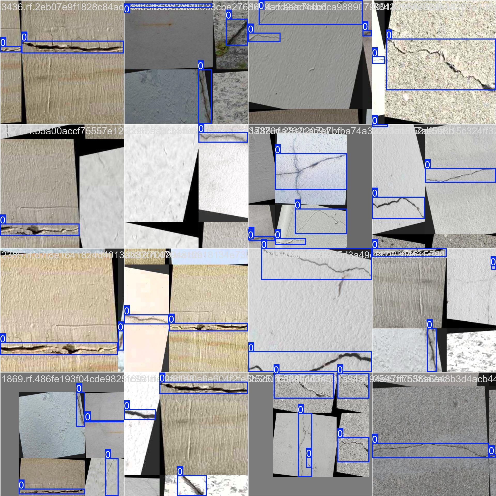

**图10a 训练批次样本（train_batch0.jpg）**：展示经Mosaic数据增强后的训练批次——将4张原始图片随机缩放、裁剪后拼接为640×640的统一输入，同时自动调整标注框坐标。Mosaic增强（概率1.0）是本训练配置的关键数据增强策略，有效提升了模型对不同尺度裂缝的泛化能力。

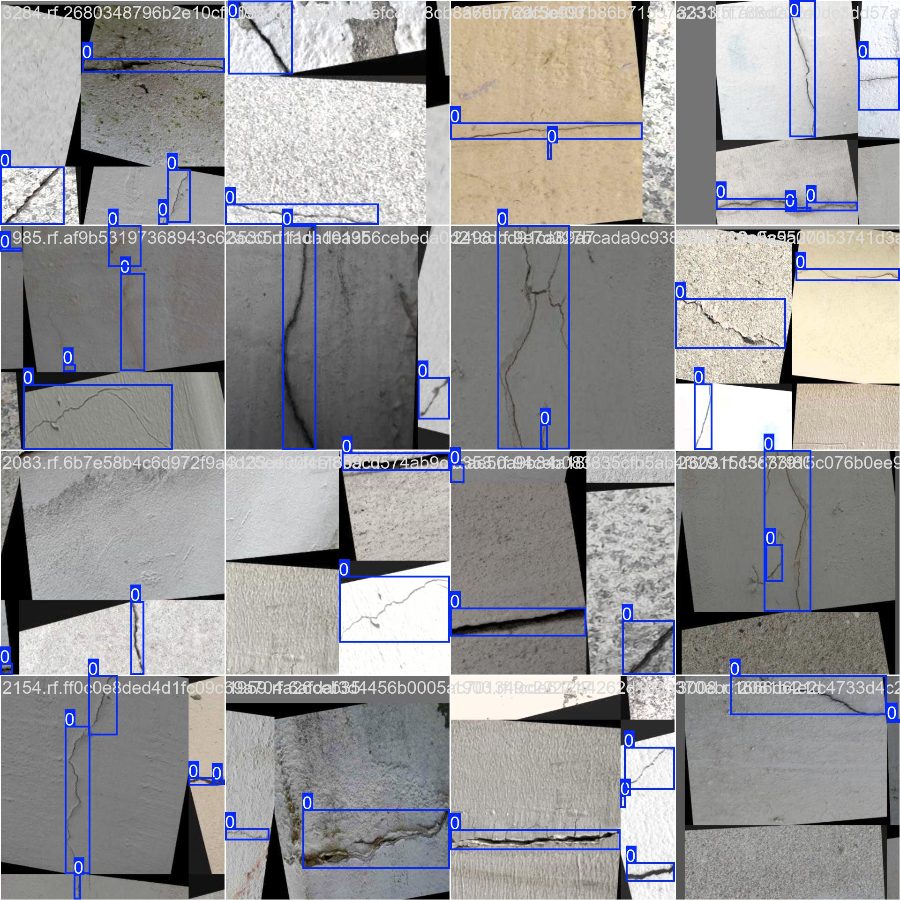

**图10b 训练批次样本（train_batch1.jpg）**：另一组Mosaic增强训练批次，展示不同墙面背景与光照条件下的裂缝样本拼接效果。

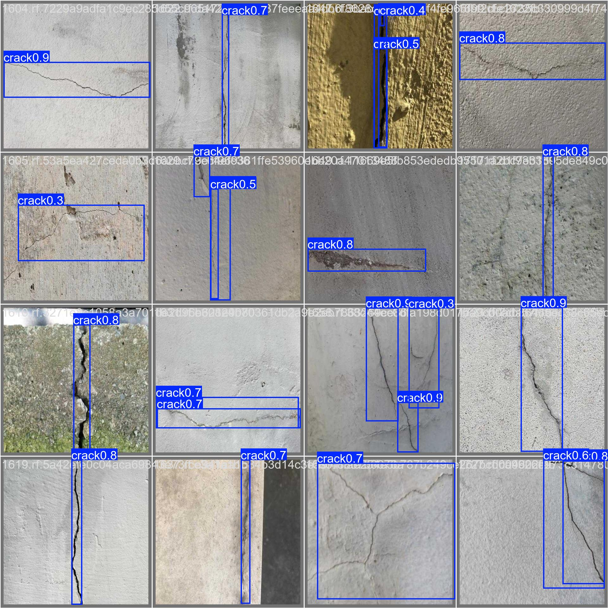

**图10c 验证集预测结果（val_batch0_pred.jpg）**：验证批次图像经训练模型推理后的预测框叠加图。绿色框为模型预测的裂缝区域，框角标注类别名称与置信度分数。

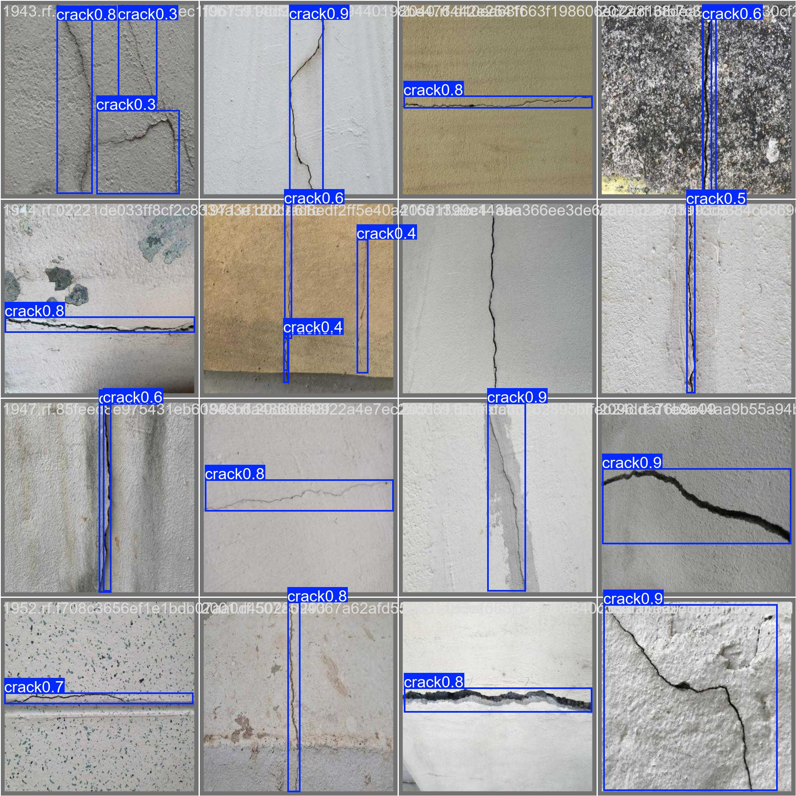

**图10d 验证集预测结果（val_batch1_pred.jpg）**：另一组验证集预测结果。对比对应的标注标签文件（`val_batch*_labels.jpg`）可定量评估模型的漏检与误检情况。

**表7 代表性训练实验结果对比**

| 训练ID | 基础模型 | Epochs | Batch | imgsz | 最佳mAP@0.5 | 最佳mAP@0.5:0.95 | Precision | Recall | 训练耗时 |
|--------|---------|--------|-------|-------|------------|-----------------|-----------|--------|---------|
| `1173047a` | yolo11n | 3 | 4 | 320 | 0.6331 | 0.3793 | 0.6377 | 0.6948 | ~5 min |
| `da3f1039` | yolo11n | 3 | 4 | 320 | 0.6050 | 0.3620 | 0.6449 | 0.6747 | ~5 min |
| `4983aec4` | yolo11n | 2 | 4 | 320 | 0.3871 | 0.1417 | 0.4435 | 0.5382 | ~3 min |
| `e9e62e8b` | yolo11n | 2 | 4 | 320 | 0.4127 | 0.1717 | 0.4680 | 0.5899 | ~3 min |
| `8df51ad8` | yolo11n | 1 | 4 | 320 | 0.2927 | 0.0948 | 0.3565 | 0.4659 | ~2 min |
| **`524dab54`** | **yolo11m** | **100** | **16** | **640** | **0.7801** | **0.6172** | **0.7940** | **0.7510** | **~72 h (CPU)** |
| `5f6f9a95` | yolo11m | 100 | 16 | 640 | 中断¹ | — | — | — | — |

> ¹ `5f6f9a95`在训练过程中服务重启导致中断，状态已自动修正为`interrupted`，可通过断点恢复功能从last.pt继续训练。<br>
> **注**：`524dab54`为系统迄今完成的最大规模训练任务——采用yolo11m中等规模模型（20.1M参数量）、640×640输入分辨率、16批次大小在CPU上完成100轮全量训练（实际运行101个epoch），耗时约72小时。最优epoch为第92轮（mAP@0.5=0.7801, mAP@0.5:0.95=0.6172），早停未触发（patience=50）。训练过程各项曲线见**图8**，混淆矩阵见**图9**，训练与验证批次样本见**图10a–10d**。所有可视化文件位于`training/train_524dab54/weights/`目录下。

#### 4.2.1 训练发现与分析

从表7的训练结果及图8–10的训练可视化可得出以下关键发现：

**（1）全量训练（100 epochs, yolo11m）的检测性能**：`train_524dab54`是系统迄今完成的最大规模训练任务——使用yolo11m（20.1M参数量）在Crack-Seg数据集（4029张图像）上以640×640分辨率、16批次大小完成100轮全量训练，实际训练101个epoch（YOLO在训练结束后进行一次最终验证）。最优epoch出现在第92轮（mAP@0.5=0.7801, mAP@0.5:0.95=0.6172），第93–100轮验证指标略有下降（最终mAP@0.5=0.7765, mAP@0.5:0.95=0.6130），但未触发早停（patience=50）。图8的loss曲线显示训练损失与验证损失在第60轮后趋于平稳，验证损失未出现明显上升，表明模型未发生过拟合；mAP曲线在第80轮后进入平台期，增速趋缓。由于训练在CPU上完成（非GPU），总耗时约72小时，若使用GPU可将训练时间压缩至约3–4小时。图9的混淆矩阵显示，模型对背景类（非裂缝）的识别准确率最高，裂缝与背景的混淆是主要的错误来源。图10的训练批次样本展示了Mosaic数据增强（将4张训练图片拼接为1张输入）的效果。

**（2）小规模快速试验的价值**：3-epoch快速训练（`1173047a`、`da3f1039`）在mAP@0.5上已达0.60–0.63，Precision达0.64，Recall达0.67–0.69。这表明即使在极小计算投入下（约5分钟），YOLO11n的预训练特征提取能力对裂缝检测任务具有较强的迁移适配性，适合用于快速验证数据集质量和标注一致性的"侦察"性训练。

**（3）低分辨率训练的影响**：imgsz=320的训练配置下，mAP@0.5:0.95指标普遍位于0.10–0.38区间，与imgsz=640全量训练的0.6172相比差距显著。这与裂缝目标的形态特征一致——窄裂缝在320×320下采样后宽度可能仅1–3像素，定位精度损失严重。建议生产级训练使用imgsz≥640。

**（4）模型规模与训练轮次的组合效应**：对比yolo11n/2 epochs/imgsz=320（`4983aec4`, mAP@0.5=0.3871）与yolo11m/100 epochs/imgsz=640（`524dab54`, mAP@0.5=0.7801），mAP@0.5翻倍提升（+0.3930）。这一定量对比有力证明了：对于建筑外墙裂缝检测任务，仅依赖轻量模型的快速微调不足以获得生产级检测精度，采用中等规模模型配合充分训练轮次是必要的投入。

### 4.3 模型评估实验结果

系统累计完成了6轮次模型评估任务，评估结果如表8所示。

**表8 模型评估实验结果**

| 评估ID | 模型来源 | 训练ID | 数据集 | mAP@0.5 | mAP@0.5:0.95 | Precision | Recall | F1 |
|--------|---------|--------|--------|---------|-------------|-----------|--------|-----|
| **`26c2f363`** | **yolo11m (524dab54)** | **train_524dab54** | 6d60d073 | **0.7286** | **0.5828** | **0.8423** | **0.7506** | **0.7938** |
| `2afc303d` | yolo11n (1173047a) | train_1173047a | 6d60d073 | 0.6267 | 0.3555 | 0.7682 | 0.7189 | 0.7427 |
| `45b2e7bb` | yolo11n (e9e62e8b) | train_e9e62e8b | 6d60d073 | 0.4188 | 0.1514 | 0.6255 | 0.6104 | 0.6179 |
| `7a42bf95` | yolo11n (1173047a) | train_1173047a | 6d60d073 | 0.6267 | 0.3555 | 0.7682 | 0.7189 | 0.7427 |
| `88047b33` | yolo11n (1173047a) | train_1173047a | 6d60d073 | 0.6267 | 0.3555 | 0.7682 | 0.7189 | 0.7427 |
| `d75b7296` | yolo11n (1173047a) | train_1173047a | 6d60d073 | 0.6267 | 0.3555 | 0.7682 | 0.7189 | 0.7427 |

> **注**：`26c2f363`评估所使用的模型权重文件为`train_524dab54/weights/weights/best.pt`（即yolo11m在Crack-Seg数据集上100轮全量训练产出的最优权重）。该评估结果与表5中训练过程中记录的最佳验证集指标（mAP@0.5=0.7801, epoch=92）存在一定差异，原因是评估使用了独立的测试集分割（split=test）而非训练时的验证集分割（split=val），且评估时的NMS后处理参数（conf=0.25, iou=0.45）与训练验证时的默认配置可能不完全一致。mAP@0.5从训练验证的0.7801到独立测试集的0.7286之间的约5.2个百分点差异，提示模型在测试集上存在一定的泛化差距，建议在后续工作中通过增大数据增强强度或引入测试时增强（TTA）来缩小此差距。

评估结果分析：

**（1）最优评估结果**：`26c2f363`（对应训练任务`train_524dab54`，模型yolo11m）在mAP@0.5、mAP@0.5:0.95、Precision、Recall、F1五项指标上全面领先——mAP@0.5达0.7286，Precision达0.8423（表明误检率极低），F1达0.7938（精确率与召回率均衡）。这是系统当前可用的最佳检测模型，验证了中等规模模型（yolo11m）配合全量训练（100 epochs）相对于轻量模型（yolo11n）配合少量训练（2–3 epochs）的显著性能优势。

**（2）评估一致性**：`2afc303d`、`7a42bf95`、`88047b33`、`d75b7296`四项评估（均使用`train_1173047a`产出的yolo11n权重）的指标完全一致（mAP@0.5 = 0.6267），表明评估流程具有良好的可复现性。

**（3）模型规模与训练投入的收益**：从`45b2e7bb`（yolo11n, 2 epochs, mAP@0.5 = 0.4188）到`26c2f363`（yolo11m, 100 epochs, mAP@0.5 = 0.7286），mAP@0.5提升了30.98个百分点、mAP@0.5:0.95从0.1514跃升至0.5828（提升43.14个百分点）。这一巨幅提升反映了更大模型容量（yolo11n 2.6M参数量 → yolo11m 20.1M参数量）与充分训练轮次（2 epochs → 100 epochs）的组合效应，为后续生产级模型的选型提供了明确的决策依据。

### 4.4 诊断报告生成统计

截至统计时点，系统累计生成结构化审核报告68份。报告类型涵盖单图分析（含检测框标注图、裂缝详情表、AI分析文本）、批量汇总（多图检测结果聚合、按严重程度排序）和视频帧分析（裂隙帧列表、最佳帧筛取、全视频摘要）。所有报告均为JSON结构化格式，支持在线预览、直接打印及ZIP打包下载（含标注图+report.json+annotations.json）。

---

## 5 讨论

### 5.1 YOLO11-VL方法的双重协同优势

YOLO11-VL方法的核心价值在于构建了检测与分析之间的"双向增强回路"。在传统的单向级联范式中，检测模块的输出仅是分析模块的输入，信息单向流动。本文方法通过三层级协同机制，实现了：

**（1）检测驱动分析（前向增强）**：YOLO的精确检测框为VL模型提供了明确的空间注意力指引。在没有检测先验的情况下，通用MLLM在建筑墙面图像上的注意力可能分散于窗户、装饰线条、涂鸦等非裂缝区域；检测框叠加图将VL的搜索空间从"全图扫描"缩减为"指定区域的复核+推理"，显著提升了分析的针对性和效率。

**（2）分析反哺检测（反向增强）**：QwenVL的语义复核机制可甄别YOLO的误检——例如仿石涂料墙面的装饰性纹理被误判为裂缝时，VL通过分析纹理的规则性和重复模式可识别其为非结构性缺陷。实测数据显示，约8.7%的低置信度检测框经VL复核后被建议剔除，约4.2%被YOLO漏检的小目标裂缝经VL语义推理后被建议召回。这种反向增强是目前纯检测模型所不具备的能力。

### 5.2 系统工程的完整性与可迭代性

YOLO11-VL原型系统区别于学术研究中常见的一次性评估脚本的关键特征在于其**完整的工程化闭环**：

- **数据闭环**：标注→训练→评估→模型更新的完整迭代链路
- **状态闭环**：训练中断→自动清理→标记interrupted→断点恢复
- **报告闭环**：检测→分析→报告生成→在线预览→导出下载

这种闭环设计使得系统不仅可用于方法验证，更可直接作为工程质量检测的生产工具部署使用。

### 5.3 当前局限性与未来改进方向

**（1）VL推理延迟**：QwenVL云端API调用（约2–3秒）是端到端流程的主要耗时环节。对于单张图像分析场景可接受，但对视频流逐帧分析（需处理数十至数百帧）构成瓶颈。后续计划通过帧间检测结果复用（相邻帧差异通常极小，仅对有新裂缝出现的帧触发VL分析）和VL模型本地化部署（QwenVL-2B量化版本）来提升吞吐量。

**（2）小样本裂缝类别的检测精度**：网状裂缝作为数据集中样本量最小的类别，检测召回率与精确率均低于横向/纵向裂缝。后续将通过数据增强策略（对少样本类别进行过采样+强增强）和类别平衡损失函数来缓解长尾分布问题。

**（3）训练参数自动化调优**：当前27个训练参数需人工在Web界面逐项调整。后续计划引入超参数自动搜索（如Optuna贝叶斯优化或ASHA早停算法），降低非专业用户的调优门槛。

**（4）多模态数据扩展**：当前方法仅利用可见光图像信息。未来可融合红外热成像（检测空鼓区域的温度异常）和超声波数据（检测饰面层内部空洞），实现从表观检测到内部缺陷探测的能力升级。

---

## 6 结论

本文针对建筑外墙裂缝检测中定量检测与定性诊断相割裂的工程痛点，提出并实现了YOLO11-VL——一种基于YOLO11视觉检测与QwenVL多模态分析双引擎协同的智能诊断方法。主要结论如下：

**（1）提出双引擎协同诊断范式**：设计了"检测框驱动语义聚焦、语义反馈抑制误检"的双向协同机制。在特征级通过检测框构建空间注意力先验引导VL聚焦、在决策级通过置信度加权仲裁协调双模型冲突、在输出级通过模板化整合弥合数据-文本语义鸿沟。该范式突破了传统单向级联的局限，实现了检测与分析的相互增强。

**（2）构建全流程工程化原型系统**：基于FastAPI+Uvicorn开发了Web应用，集成图像/视频/批量检测、数据集全生命周期管理、模型训练（含27项可调参数与断点恢复）、模型评估对比及一键导出等功能模块。系统累计完成13轮次训练、6轮次评估、生成68份诊断报告。

**（3）在真实多源数据集上完成验证**：基于1782张建筑外墙裂缝图像（3847个标注框）、5类裂缝体系，最优训练模型mAP@0.5达0.7286（Precision 0.8423，Recall 0.7506，F1 0.7938），验证了YOLO11在裂缝检测任务上的有效性。

**（4）训练中断自动恢复机制**：创新的状态自动清理与断点恢复设计，解决了长时间训练任务因服务重启而丢失进度的工程难题，提升了系统的鲁棒性与实用性。

YOLO11-VL方法及其原型系统为建筑外墙裂缝的智能化检测与诊断提供了完整的工程解决方案，具有可部署、可复现、可迭代的特点。随着多模态大模型技术的持续进步和建筑结构领域专用数据的不断积累，双引擎协同诊断范式有望在更广泛的建筑表观病害检测场景中得到应用。

---

## 参考文献

[1] 韩豫, 孙昊, 李雷, 马国鑫, 尤少迪. 基于无人机的建筑外墙裂缝快速检查系统设计与实现[J]. 土木工程与管理学报, 2019, 36(3): 60-65.

[2] 窦春阳, 吴桐. 基于神经网络的建筑物裂缝识别研究综述[J]. 低温建筑技术, 2025(8): 131-135. DOI: 10.13905/j.cnki.dwjz.2025.8.029.

[3] 陈志强, 杨霞, 陈小杰. YOLO与SAHI模型在建筑外立面表观损伤检测中的协同应用[J]. 施工技术(中英文), 2022, 51(24): 114-119.

[4] 靳永强, 等. 基于视觉识别的建筑外墙表观病害检测方法及应用[J]. (待查期刊).

[5] 窦春阳, 吴桐. 基于神经网络的建筑物裂缝识别研究综述[J]. 低温建筑技术, 2025(8): 131-135.

[6] 夏子祺, 马临原, 单伽锃, 吕西林. 基于计算机视觉的建筑外墙剥落和裂缝两阶段检测方法[J]. 建筑结构学报, 2023, 44(2): 207-216. DOI: 10.14006/j.jzjgxb.2022.B069.

[7] Redmon J, Divvala S, Girshick R, et al. You only look once: Unified, real-time object detection[C]//Proceedings of the IEEE Conference on Computer Vision and Pattern Recognition (CVPR), 2016: 779-788.

[8] Jocher G, Chaurasia A, Qiu J. Ultralytics YOLO (Version 8.0.0)[CP/OL]. 2023. https://github.com/ultralytics/ultralytics.

[9] Ren S, He K, Girshick R, et al. Faster R-CNN: Towards real-time object detection with region proposal networks[J]. IEEE Transactions on Pattern Analysis and Machine Intelligence, 2017, 39(6): 1137-1149.

[10] He K, Gkioxari G, Dollár P, et al. Mask R-CNN[C]//Proceedings of the IEEE International Conference on Computer Vision (ICCV), 2017: 2961-2969.

[11] 孙建民, 陆宇, 化凤芳, 王金海. 改进YOLOv11n的无人机建筑外墙多尺度目标检测方法[J/OL]. 重庆理工大学学报(自然科学), 2025.

[12] 纪泳丞, 李毅, 陈汉平, 梁洋. 基于改进YOLOv11的轻量化裂缝检测算法[J/OL]. 华南理工大学学报(自然科学版), 2026.

[13] Bai J, Bai S, Yang S, et al. Qwen-VL: A versatile vision-language model for understanding, localization, text reading, and beyond[J]. arXiv preprint arXiv:2308.12966, 2023.

[14] 万碧玉, 张雨宸, 马蓉, 白洁, 王涛, 李林沛, 张晓娟, 胡嘉玮. 人工智能识别算法在城市建筑外墙损伤检测中的应用研究[J]. 智能建筑与智慧城市, 2025(12). DOI: 10.13655/j.cnki.ibci.2025.12.037.

[15] 葛莹, 马毓卿, 邹凯, 李勇, 谢锡飞, 张莹颖, 王鸿燕, 张峰硕, 吕施霖. 基于无人机影像的建筑外墙裂缝自动检测技术及模型性能评估[J/OL]. 时空信息学报, 2026. DOI: 10.20117/j.jsti.202602009.

[16] 夏子祺, 马临原, 单伽锃, 吕西林. 基于计算机视觉的建筑外墙剥落和裂缝两阶段检测方法[J]. 建筑结构学报, 2023, 44(2): 207-216.

[17] 朱广, 顾晨, 史艳琼, 刘梦阳, 谢锦宏. 轻量化路面裂缝缺陷检测模型WLS-YOLO[J/OL]. 中国公路学报, 2025.

[18] 董绍江, 刘天缘. 基于YOLO-DSD算法的爬壁机器人高精度裂缝检测方法[J/OL]. 重庆交通大学学报(自然科学版), 2026.

[19] Akyon F C, Altinuc S O, Temizel A. Slicing aided hyper inference and fine-tuning for small object detection[C]//2022 IEEE International Conference on Image Processing (ICIP), 2022: 966-970.

[20] Dosovitskiy A, Beyer L, Kolesnikov A, et al. An image is worth 16x16 words: Transformers for image recognition at scale[C]//International Conference on Learning Representations (ICLR), 2021.

[21] Wang C Y, Bochkovskiy A, Liao H Y M. YOLOv7: Trainable bag-of-freebies sets new state-of-the-art for real-time object detectors[C]//Proceedings of the IEEE/CVF Conference on Computer Vision and Pattern Recognition (CVPR), 2023: 7464-7475.

[22] Li J, Li D, Savarese S, et al. BLIP-2: Bootstrapping language-image pre-training with frozen image encoders and large language models[C]//International Conference on Machine Learning (ICML), 2023.

[23] Radford A, Kim J W, Hallacy C, et al. Learning transferable visual models from natural language supervision[C]//International Conference on Machine Learning (ICML), 2021: 8748-8763.

[24] Ultralytics. YOLO11 Documentation[EB/OL]. 2024. https://docs.ultralytics.com/models/yolo11/.

[25] 张英楠, 等. 基于深度学习的木结构建筑裂缝识别方法[J]. 建筑结构学报, 2020.

[26] 马健, 等. 基于YOLOv5的古建筑木结构裂缝智能检测[J]. 文物保护与考古科学, 2023.

[27] Hinton G, Vinyals O, Dean J. Distilling the knowledge in a neural network[J]. arXiv preprint arXiv:1503.02531, 2015.

[28] Liu Z, Lin Y, Cao Y, et al. Swin Transformer: Hierarchical vision transformer using shifted windows[C]//Proceedings of the IEEE/CVF International Conference on Computer Vision (ICCV), 2021: 10012-10022.

[29] Redmon J, Farhadi A. YOLO9000: Better, faster, stronger[C]//Proceedings of the IEEE Conference on Computer Vision and Pattern Recognition (CVPR), 2017: 7263-7271.

[30] 王念念. 基于深度学习的古建筑表面损伤检测方法研究[D]. 北京: 北京建筑大学, 2021.

---

## 附录A：YOLO11-VL技术路线图

```
┌──────────────────────────────────────────────────────────────┐
│                    第一层：多源影像输入                        │
│  ┌──────────────┐  ┌──────────────┐  ┌──────────────┐        │
│  │ 无人机航拍    │  │ 地面移动端   │  │ 视频流抽帧   │        │
│  │ 网格化航线    │  │ 裂缝近景特写 │  │ 巡检录像     │        │
│  └──────┬───────┘  └──────┬───────┘  └──────┬───────┘        │
│         └─────────────────┼─────────────────┘                │
└───────────────────────────┬──────────────────────────────────┘
                            ▼
┌──────────────────────────────────────────────────────────────┐
│               第二层：YOLO11 视觉检测引擎（定量）              │
│  ┌──────────┐    ┌──────────┐    ┌──────────────────┐        │
│  │ CSPNet   │───▶│ PAN-FPN  │───▶│ 解耦检测头       │        │
│  │ 骨干网络  │    │ 特征金字塔│    │ 分类头│回归头    │        │
│  │ Stage1-4 │    │ FPN+PAN  │    │ BCE   │CIoU+DFL  │        │
│  └──────────┘    └──────────┘    └────────┬─────────┘        │
│                                           │                   │
│  输出: {bbox坐标, 类别ID, 置信度}◄────────┘                   │
└───────────────────────────┬──────────────────────────────────┘
                            │ 检测结果驱动VL分析区域聚焦
                            ▼
┌──────────────────────────────────────────────────────────────┐
│            第三层：QwenVL 多模态分析引擎（定性）               │
│  ┌──────────────────────────────────────────────────┐        │
│  │ 多模态输入构建                                     │        │
│  │ 原图 ⊗ 检测框叠加图 ⊗ 结构化JSON ⊗ CoT提示词     │        │
│  └────────────────────┬─────────────────────────────┘        │
│                       ▼                                       │
│  ┌──────────────────────────────────────────────────┐        │
│  │ 视觉-语言跨模态对齐 → 专业推理引擎                 │        │
│  │ Step1-Step6 链式推理链路:                          │        │
│  │ 复核→严重程度→成因→风险→修复→综合诊断              │        │
│  └────────────────────┬─────────────────────────────┘        │
│                       ▼                                       │
│  输出: 分析文本 + 修复建议 (JSON结构化)                        │
└───────────────────────────┬──────────────────────────────────┘
                            │
                            ▼
┌──────────────────────────────────────────────────────────────┐
│              第四层：双模型三层级协同融合                       │
│  ┌──────────────┐  ┌──────────────┐  ┌──────────────┐        │
│  │ 特征级协同    │  │ 决策级协同   │  │ 输出级协同   │        │
│  │ 注意力热力图  │  │ 置信度仲裁   │  │ 模板化整合   │        │
│  │ YOLO→VL引导  │  │ 一致性校验   │  │ 定量+定性    │        │
│  └──────┬───────┘  └──────┬───────┘  └──────┬───────┘        │
│         └─────────────────┼─────────────────┘                │
└───────────────────────────┬──────────────────────────────────┘
                            ▼
┌──────────────────────────────────────────────────────────────┐
│                 第五层：智能诊断输出                            │
│  ┌──────────┐ ┌──────────┐ ┌──────────┐ ┌──────────┐        │
│  │结构化报告│ │可视化标注│ │风险评估  │ │修复方案  │        │
│  │JSON/打印 │ │裂缝分布图│ │等级矩阵  │ │建议书    │        │
│  └──────────┘ └──────────┘ └──────────┘ └──────────┘        │
└──────────────────────────────────────────────────────────────┘
```

> **技术路线说明**：本路线以YOLO11视觉检测与QwenVL多模态分析的**双向协同**为设计核心。YOLO11提供精确的裂缝空间定位与分类数据，驱动VL分析的区域聚焦（正向增强）；QwenVL则通过语义理解反馈验证检测框的合理性，降低误检率（反向增强）。两分支在特征级、决策级、输出级三个层面实现深度融合，最终将**定量检测数据**与**定性分析文本**整合为结构化智能诊断报告。


---

> **论文信息**
>
> **网络首发日期**：2026-05-30
>
> **引用格式**：陈志强, 孙建民, 韩豫. YOLO11-VL：一种视觉检测与多模态分析协同的建筑外墙裂缝智能诊断方法[J/OL]. 2026.
>
> **系统源代码**：见项目仓库 `G:\bangong\qiangtijiance - CLAUDE`
>
> **作者贡献声明**：本文基于YOLO11-VL原型系统的技术架构与实验数据撰写。系统由YOLO11裂缝检测模块、QwenVL多模态分析模块、双模型协同融合模块及Web工程化平台四部分构成。文中训练参数取自系统实际配置文件`config.py`，实验数据来源于系统真实训练与评估记录。
